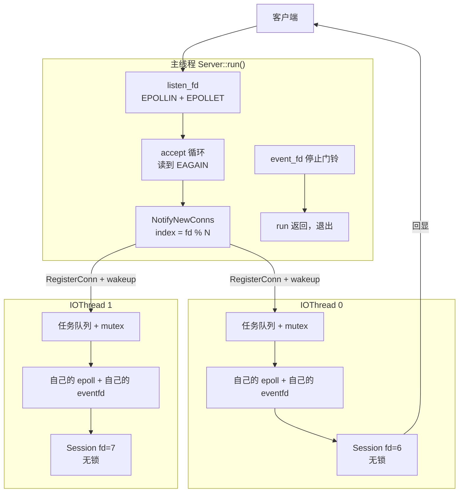
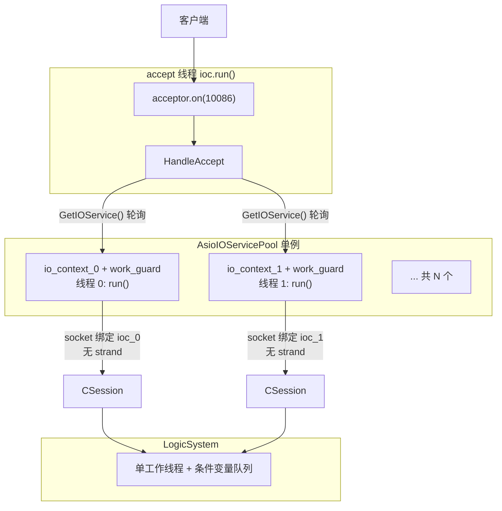
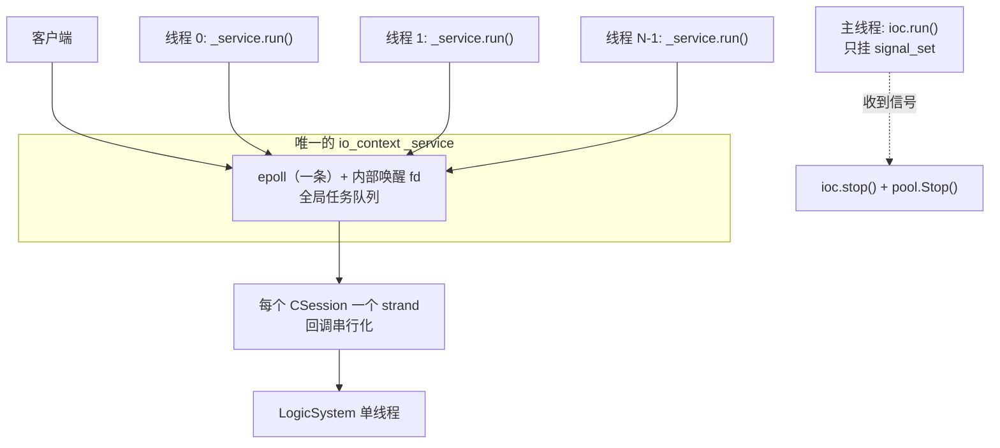
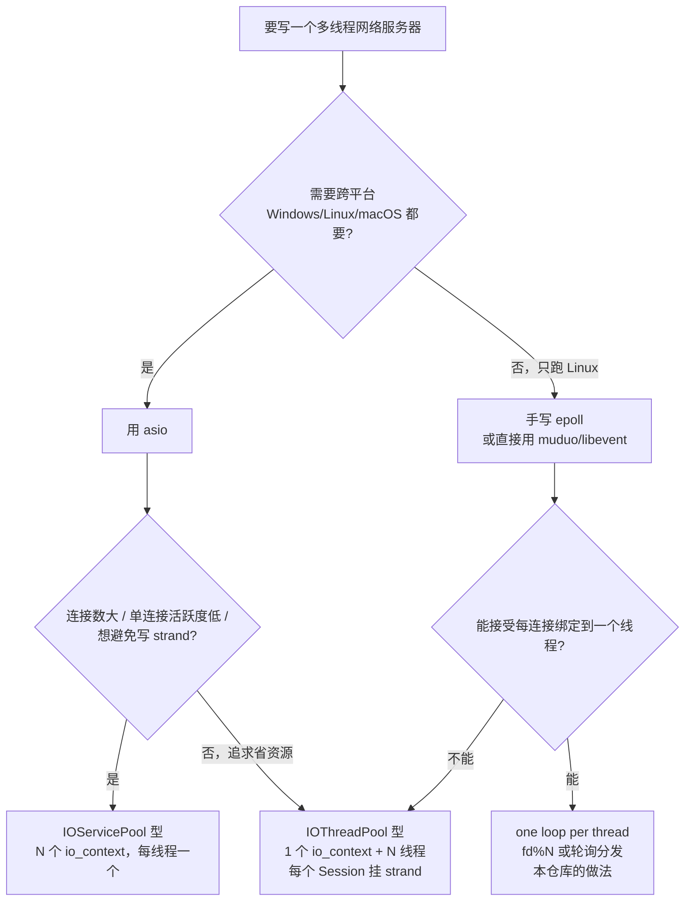

# epoll 手写服务器 vs asio IOServicePool vs asio IOThreadPool —— 面试口径全对比

> **对比对象**
>
> | 代号 | 工程 | 源码位置 |
> | --- | --- | --- |
> | **A · epoll** | Linux 手写 Reactor 服务器（`Server` / `EventLoop` / `IOThread` / `Session`） | 本仓库 `include/`、`src/` |
> | **B · IOServicePool** | `0719asio多线程模型IOServicePool` | `AsyncServer/` |
> | **C · IOThreadPool** | `0720asio多线程模型IOThreadPool` | `AsyncServer/` |
>
> **前提说明（面试时也要主动交代）**
>
> 1. 本文所有结论来自对**当前源码**的静态阅读，未编译、未压测。
> 2. A 是 Linux 平台的 `epoll + eventfd`；B/C 是 Windows + vcpkg Boost 工程（`x64\Debug` 下有构建产物），asio 在 Windows 上底层走的是 IOCP。**"线程模型"三者可以直接比，"IO 多路复用实现"这一层必须点明平台差异**——这正是 asio 的价值：把 epoll / IOCP / kqueue 抽象成一个 `io_context`。
> 3. B 的工程里同时存在 `AsyncServer.cpp` 与 `AsyncServer2.cpp` 两份 `main`（`.vcxproj` 第 143、144 行同时包含），直接编译会 `LNK2005` 重复定义 `main`，实际使用要排除一份。下文以 `AsyncServer.cpp` 为主线，并在文中标注 `AsyncServer2.cpp` 的差异。

**目录**

0. [一页速记：面试开场 60 秒](#0-一页速记面试开场-60-秒)
1. [先把"是什么"钉死](#1-先把是什么钉死)
2. [三张线程模型图](#2-三张线程模型图)
3. [总对比表（面试可以直接照抄这张表）](#3-总对比表面试可以直接照抄这张表)
4. [面试问答 12 题](#4-面试问答-12-题)
5. [专题：为什么 A 可以完全不加锁](#5-专题为什么-a-可以完全不加锁)
6. [专题：strand 到底解决什么问题](#6-专题strand-到底解决什么问题)
7. [代码里真实存在的缺陷（"你在项目里发现了什么"）](#7-代码里真实存在的缺陷你在项目里发现了什么)
8. [选型决策](#8-选型决策)
9. [背诵口诀与自测题](#9-背诵口诀与自测题)
10. [附录：文件:行号速查](#10-附录文件行号速查)

---

## 0. 一页速记：面试开场 60 秒

三份代码其实在回答同一个问题：**多核机器上，到底谁去跑事件循环？** 答案只有两种：一人一个循环，或者一群人抢一个循环。

| | 一句话定位 | 循环 : 线程 |
| --- | --- | --- |
| **A · epoll** | 主线程只 `accept`，新连接按 `fd % N` 分给 N 个 IO 线程；每个 IO 线程有自己的 `epoll`，负责这条连接的一生 | **多循环、每循环一线程**（one loop per thread） |
| **B · IOServicePool** | 池子里 N 个 `io_context`，每个被一个线程 `run()`；`accept` 成功后**轮询**挑一个 `io_context` 给新连接 | **多循环、每循环一线程** |
| **C · IOThreadPool** | 只有 1 个 `io_context`，N 个线程一起 `run()`；accept 和所有连接都在这一条队列上 | **单循环、多线程**（one loop many threads） |

再补一条同样重要的差异：**A 是手写 Reactor（就绪事件），B/C 是 asio Proactor（完成事件）**。A 要自己处理 `EAGAIN`、半包、部分写、`EPOLLOUT` 增删；B/C 把这些全部交给 `async_read` / `async_write`。

可以直接背的版本：

> "三者都是多 Reactor 的变体，差别只在两点：**几个事件循环、谁跑事件循环**。A 和 B 是 one loop per thread——A 用 `fd % N` 在 accept 时把连接绑死到某个线程，B 用轮询把连接绑死到某个 `io_context`；因为是'一个循环一个线程'，同一个连接的回调天然串行，所以 A 的 `Session` 里一把锁都没有，B 也不需要 strand。C 是 one loop many threads——`io_context` 保证同一个 handler 不会被两个线程同时执行，但**不保证同一个连接的两个不同 handler 不并发**，所以 C 必须给每个 `Session` 挂一个 `strand`。另外 A 是手写 Reactor，半包和部分写要自己写状态机；B/C 用 asio 的组合操作，这部分是库能力。"

---

## 1. 先把"是什么"钉死

### 1.1 A · epoll 手写服务器（本仓库 `src/`）

| 角色 | 类 | 职责 |
| --- | --- | --- |
| 接入线程 | `Server` | socket/bind/listen，自己的 `epoll`（只挂 `listen_fd` + 停止用 `event_fd`），`accept` 循环，按 `fd % N` 分发 |
| 线程池 | `EventLoop` | 建 N 个 `IOThread` 并 `start()`；`NotifyNewConns` 做分发与批量唤醒 |
| 事件循环 | `IOThread` | 自己的 `epoll`、自己的 `eventfd`、任务队列、拆包状态机、发送与 `EPOLLOUT` |
| 连接状态 | `Session` | 收发缓冲、`HeadBuf`/`DataBuf`、协议头拼装、发送队列；**内部没有任何锁** |

关键事实：

- `Server` 构造里把监听 fd 设成 `EPOLLIN | EPOLLET`（`server.cpp:38`），线程数来自 `config.ini`（`server.cpp:64-66`，`config.ini` 里是 `thread_num = 4`）。
- `Server::run()` 是主线程的 `epoll_wait(-1)` 循环（`server.cpp:120-176`），里面只有两个分支：`listen_fd` 可读 → `accept` 循环；`event_fd` 可读 → 直接 `return`。
- `accept` 循环读**到 `EAGAIN` 才退出**（`server.cpp:145-163`），一次事件里收到的连接先攒进 `_conn_fds`，再统一 `NotifyNewConns`（`server.cpp:160-163`）。
- 分发策略：`auto index = fd % _work_threads.size();`（`event_loop.cpp:35`），入队用 `catch_new_conn`（**故意不唤醒**，`io_thread.cpp:149-155`），最后对涉及的线程各 `wakeup()` 一次（`event_loop.cpp:41-43`）。
- `IOThread` 构造时建自己的 `eventfd` + 自己的 `epoll`（`io_thread.cpp:5-34`）；`start()` 起线程跑 `loop()`（`io_thread.cpp:102-107`）。
- `loop()`：扩容事件数组 → `EPOLLERR|EPOLLHUP` → `eventfd` → 客户端 fd（**先处理 `EPOLLIN`，再处理 `EPOLLOUT`**）（`io_thread.cpp:380-500`）。
- 跨线程只有三类任务：`RegisterConn` / `SendData` / `ShutDown`（`io_thread.h:24-28`，`io_thread.cpp:160-214`）。
- 业务逻辑目前**就在 IO 线程里**：`read_body_data` 收完包直接 `sess->Send(...)` 回显（`io_thread.cpp:323-330`）。

### 1.2 B · IOServicePool（`0719`）

| 角色 | 类 | 职责 |
| --- | --- | --- |
| 池 | `AsioIOServicePool`（单例） | N 个 `io_context` + N 个 `work_guard` + N 个线程；`GetIOService()` 轮询返回一个 `io_context` |
| 接入 | `CServer` | acceptor 建在传入的 `io_context` 上；**每次 `StartAccept` 先要一个池里的 `io_context`**，用它的 socket 构造 `CSession` |
| 连接 | `CSession` | `async_read` 定长读头 → 定长读体；`_send_que` + `_send_lock` 发送队列；**无 strand** |
| 业务 | `LogicSystem`（单例） | 一个工作线程 + 条件变量队列，按 `msg_id` 查回调表处理，再 `session->Send(...)` |

关键事实：

- 池的构造：`_ioServices(size)`、`_works(size)`、`_nextIOService(0)`，每个 `io_context` 一个 `make_work_guard`（防止没有任务时 `run()` 立刻返回），然后每线程 `_ioServices[i].run()`（`AsioIOServicePool.cpp:37-49`）。
- 分配策略：`_ioServices[(_nextIOService++) % _ioServices.size()]`（`AsioIOServicePool.cpp:9-13`）——**轮询**，不是取模。
- `CServer::StartAccept()`：先 `GetIOService()`，再 `make_shared<CSession>(io_context, this)`，然后 `async_accept`（`CServer.cpp:20-26`）。也就是说**连接在 accept 之前就已经定好了归属哪个 `io_context`**。
- `main`（`AsyncServer.cpp`）：`ioc` 交给独立线程 `net_work_thread`，在里面构造 `CServer` 并 `ioc.run()`（第 28-30 行）；主线程用 `condition_variable` 等信号，收到后 `ioc.stop()` + `join`（第 33-42 行）。→ **accept 由一条独立线程负责**。
- `AsyncServer2.cpp` 是同一模型的另一种写法：不用条件变量，改 `boost::asio::signal_set` + 主线程 `io_context.run()`。语义差别不大，只是"谁在等信号、accept 循环跑在哪条线程"的写法不同。
- `CSession` 无 strand，靠 `_send_lock` 保护发送队列（`CSession.cpp:45/62/86`）。

### 1.3 C · IOThreadPool（`0720`）

| 角色 | 类 | 职责 |
| --- | --- | --- |
| 池 | `AsioThreadPool`（单例） | **1 个** `io_context` + **1 个** `work_guard` + N 个线程同时 `_service.run()` |
| 接入 | `CServer` | acceptor 直接建在池的那个 `io_context` 上（`main.cpp:18`） |
| 连接 | `CSession` | 和 B 几乎一样，**多了 `_strand`**，所有异步回调都 `bind_executor(_strand, ...)` |
| 业务 | `LogicSystem` | 与 B 相同 |

关键事实：

- `AsioThreadPool` 只有一个成员 `_service`（`AsioThreadPool.h:23`），`GetIOService()` 直接 `return _service;`（`AsioThreadPool.cpp:8-10`），N 个线程跑同一个 `run()`（`AsioThreadPool.cpp:21-29`）。
- `main`：主线程的 `ioc` 只挂 `signal_set`（`main.cpp:12`），`CServer s(pool->GetIOService(), 10086);`（`main.cpp:18`）把监听器建在池的 `io_context` 上，最后 `ioc.run()` 阻塞主线程等信号（`main.cpp:20`）。→ **accept 由池内任意一条线程执行，不再是独立线程**。
- `CSession` 的每个 `async_read` / `async_write` 都包了 `bind_executor(_strand, ...)`（`CSession.h:55`，`CSession.cpp:39/59/78/97/144/170`）。
- 其余（`CServer`、`LogicSystem`、`MsgNode`、`const.h`）与 B 基本逐行相同——**这两个工程的差别几乎只在"几个 `io_context`、有没有 strand"**。

---

## 2. 三张线程模型图

### 2.1 A · epoll：1 个 accept 线程 + N 个自带 epoll 的 IO 线程

要点：**连接一旦被分配，就永远只被那一个线程碰**；线程之间只有"任务队列 + eventfd"这一条通道。

### 2.2 B · IOServicePool：N 个 io_context，每个一条线程

要点：`io_context` 与线程是 **1 : 1**，所以每个 `Session` 的所有回调天然串行；`GetIOService()` 的轮询决定了负载怎么分。

### 2.3 C · IOThreadPool：1 个 io_context，N 条线程

要点：**事件收集是单点的，回调执行是并行的**——这就是 strand 存在的全部理由。

---

## 3. 总对比表（面试可以直接照抄这张表）

| # | 维度 | A · epoll 手写 | B · IOServicePool | C · IOThreadPool |
| --- | --- | --- | --- | --- |
| 1 | 事件循环数量 | N + 1（主 accept + N 个 IO） | N + 1（accept 线程 + N 个 `io_context`） | **1** |
| 2 | 循环 : 线程 | 1 : 1 | 1 : 1 | **N : 1** |
| 3 | 谁负责 accept | 主线程（`server.cpp:146`） | 独立线程（`AsyncServer.cpp:28-30`） | 池内任意线程（`main.cpp:18`） |
| 4 | 连接归属策略 | `fd % N`（`event_loop.cpp:35`） | 轮询取 `io_context`（`AsioIOServicePool.cpp:11`） | 无归属，所有连接共享一个循环 |
| 5 | 跨线程通道 | `IOTask` 队列 + `eventfd`（`io_thread.cpp:131-137`、`109-112`） | `io_context` 自身的任务队列（由 socket 绑定的 executor 决定归属） | 同 B，但只有一条全局队列 |
| 6 | `Session` 内部锁 | **没有锁** | `_send_lock` | `_send_lock` |
| 7 | 是否需要 strand | 不需要 | 不需要 | **必须** |
| 8 | IO 多路复用 | Linux `epoll`（**ET**） | asio 封装（Windows IOCP / Linux epoll LT） | 同 B |
| 9 | 编程模型 | Reactor（就绪） | Proactor（完成） | Proactor |
| 10 | 半包 / 粘包 | 手写状态机（`io_thread.cpp:219-338`） | `async_read` 定长读，天然处理 | 同 B |
| 11 | 部分写 | 手写 offset + `EPOLLOUT`（`session.cpp:76-125`、`io_thread.cpp:341-388`） | `async_write` 内部处理 | 同 B |
| 12 | 发送背压 | 无上限，无限制 | `MAX_SENDQUE=1000`，超了**直接丢**（`CSession.cpp:63-67`） | 同 B |
| 13 | 业务处理位置 | **IO 线程内**直接回显（`io_thread.cpp:323-330`） | `LogicSystem` 单线程 + 条件变量队列 | 同 B |
| 14 | 连接表 | 每线程私有的 `_sessions`（`fd → Session`） | `CServer::_sessions`（`uuid → Session`），**无锁跨线程访问** | 同 B（竞争更明显） |
| 15 | 优雅退出 | `StopIOThread` 投递 `ShutDown` 任务（`event_loop.cpp:24-30`、`io_thread.cpp:208-210`） | 信号 → `ioc.stop()` + `pool->Stop()` | 同 B（`signal_set` + `pool->Stop()`） |
| 16 | 内核资源 | N+1 个 epoll + N+1 个 eventfd | N+1 个 `io_context`（各含 epoll + 唤醒 fd） | **1 个** `io_context` |
| 17 | 负载均衡 | 取模，fd 复用时易偏斜 | 轮询，较均匀 | 单队列，天然全局均衡但有争用 |
| 18 | 扩展性 | 好（无共享，无可伸缩性瓶颈） | 好（同 A） | 一般（共享 `io_context` 内部锁 + strand 开销） |
| 19 | 代码量与可控性 | 多（所有 `errno` 与边界自己扛） | 少 | 少 |
| 20 | 外部依赖 | 无 | Boost.Asio | Boost.Asio |

### 一句话映射到 muduo

| 本项目 | muduo 对应物 |
| --- | --- |
| A 的 `Server`（主线程 accept + `fd % N` 分发） | `Acceptor` + `EventLoopThreadPool` + `TcpServer` |
| A 的 `IOThread` | `EventLoop`（含 `EventLoopThread`） |
| A 的 `Session` | `TcpConnection` |
| A 的 `IOTask` 队列 + `eventfd` | `runInLoop` / `queueInLoop` + `wakeupFd` |
| B 的 `AsioIOServicePool` | 同样是"one loop per thread"的线程池，只是循环换成了 `io_context` |
| C 的 `AsioThreadPool` | muduo 里**不采用**这种拓扑（muduo 坚持 one loop per thread），需要时用 strand 类等价机制 |

---

## 4. 面试问答 12 题

### Q1：用一句话说清三种模型的线程模型差异

**答**：A 和 B 都是 one loop per thread（一个事件循环独占一条线程），区别是 A 在 accept 时用 `fd % N` 绑定、B 在 accept 前轮询选 `io_context`；C 是 one loop many threads（一个 `io_context` 被 N 条线程 `run()`）。

**追问"那不就是线程池吗"**：要区分**线程池跑什么**。C 是"N 条线程抢同一份事件队列"，A/B 是"N 条线程各有一份自己的事件队列"。前者要处理回调并发，后者天然没有。

### Q2：为什么 B 不需要 strand，C 必须加 strand？（高频）

**答**：

- B 的每个 `io_context` 只被**一条**线程 `run()`（`AsioIOServicePool.cpp:44-49`），而一个 socket 的回调只会在这条线程上被调用 → 同一个 `Session` 的回调天然串行。strand 的语义在这个拓扑下是**自动成立**的，加了也只是多一层转发开销。
- C 只有 1 个 `io_context`（`AsioThreadPool.h:23`），N 条线程同时 `run()`（`AsioThreadPool.cpp:25-28`）。asio 只保证"同一个 handler 实例不会被两条线程同时执行"，**不保证"同一个 socket 的两个不同 handler 不并发"**。例如 `HandleWrite`（写完成）和 `HandleReadHead`（读完成）可能同时跑在两条线程上，于是 `_send_que`、`_recv_msg_node`、甚至同一个 socket 都会被并发访问；更危险的是两次 `async_write` 交错会让发出的字节流错乱。
- 所以 C 给每个 `Session` 挂一个 `_strand`，把所有异步回调都 `bind_executor(_strand, ...)`，让同一个连接的回调排进同一条串行队列。

**必须补的一句（否则会被抓住）**：**strand 不是锁**。strand 不阻塞，只保证"不并发执行 + 保持入队顺序"；它保护不了 strand 之外的线程。所以 C 里 `_send_lock` 依然保留（`CSession.cpp:47/66/92`），因为 `LogicSystem` 的业务线程会直接调 `CSession::Send`，那条路径不在 strand 上。

### Q3：A 的 `Session` 里为什么一把锁都没有？它凭什么线程安全？

**答**：靠一条不变量——**一条连接只属于一个线程**。

1. 分配是"一次性定死"的：`NotifyNewConns` 里 `index = fd % N`，之后不再迁移（`event_loop.cpp:31-44`）。
2. 该连接的所有读写、拆包、关闭都在属主线程内完成（`io_thread.cpp:171-176`、`442-500`）。
3. `_sessions`（`fd → Session`）是 `IOThread` 的私有成员，只被属主线程访问（`io_thread.h:97`、`io_thread.cpp:87-91`）。
4. 唯一设计成可跨线程调用的入口是 `Session::Send(std::string, int)`，它**只投递任务、不碰连接状态**（`session.cpp:68-70`）。

所以 `Session` 的 `_head_buf` / `_data_buf` / `_recv_stage` / `_send_que` 都不需要同步——这不是"漏加锁"，而是用"线程绑定"换来的免锁设计。

**收尾（体现你知道代价）**：代价是"业务必须搬回 IO 线程执行"，而且这条不变量一旦被破坏（比如把某个 fd 转交给别的线程处理），整条免锁链立刻失效，必须重新审计所有同步假设。

### Q4：跨线程投递任务，怎么保证不丢唤醒？

**答**：看投递侧和消费侧的**顺序**。

- 投递侧：先加锁 `push`，出锁后再 `write(eventfd, 8 字节)`（`io_thread.cpp:131-137`）。
- 消费侧：先 `read(eventfd)` 清计数（`io_thread.cpp:429-431`），**再**把整个队列 `swap` 出来（`io_thread.cpp:160-166`）。

两种交错都安全：

- push 发生在 swap 之前 → 这次 swap 一定能取到；
- push 发生在 swap 之后 → 投递方也写了 eventfd，计数非 0，`epoll_wait` 会立刻再返回一次。

**加分点**：`catch_new_conn` 是故意的"只入队不唤醒"（`io_thread.cpp:149-155`），唤醒由 `NotifyNewConns` 用 `unordered_set` 去重后统一发（`event_loop.cpp:32-43`）——一次 epoll 事件里收到 100 个新连接、落在 4 个线程上，只写 4 次 eventfd，而不是 100 次。

### Q5：为什么 A 要读到 `EAGAIN`，B/C 完全不用管？

**答**：

- A 用的是 **ET（边缘触发）**（`server.cpp:38`、`io_thread.cpp:175`）。ET 只在状态变化时通知一次，所以必须一次把数据读干净，否则剩下的字节不会再触发事件——`while(1)` 一直读到 `IO_EAGAIN` 就是这个原因（`io_thread.cpp:444-480`）。同时 socket 必须是非阻塞的（`io_thread.cpp:93-97`），否则 `read` 会把整条线程挂住。
- B/C 用 `async_read` / `async_write` 这类**组合操作**：底层的 `EPOLLIN`/`EPOLLOUT` 注册、socket 的非阻塞属性、剩余字节的续读，全部由 asio 管理；回调只在"请求的字节数读满/写完，或者出错"时才触发。

**加分点**：A 里那套 `NO_RECV / HEAD_RECVING / BODY_RECVING` 状态机（`session.h:19-24`、`io_thread.cpp:219-338`），本质就是**在手工实现 `async_read` 的语义**；asio 把它变成了库能力，这是"手写 Reactor 还是用 Proactor 框架"最直观的差别。

### Q6：发送不出去怎么办？三者的部分写与背压怎么处理？

**答**：

- **A**：`Session::send_data` 用 `while + offset` 循环写，遇 `EAGAIN` 返回 `IO_EAGAIN`（`session.cpp:76-125`），调用方把该 fd 改成 `EPOLLIN | EPOLLOUT | EPOLLET`（`io_thread.cpp:200`）；`handle_epollout` 继续写，队列排空后再摘掉 `EPOLLOUT`（`io_thread.cpp:382-388`）。教科书式的 Reactor 部分写处理。
- **B/C**：`Send` 把消息塞进 `_send_que`，**只有队列原本为空时**才发起 `async_write`；`HandleWrite` 里 `pop` 掉当前节点，若队列还有就接着发下一条（`CSession.cpp:62-79`、`86-104`）。这套"队列 + 一次只有一个 outstanding write"正好满足 `async_write` 的前置条件。
- **背压**：三者都没真正做。A 的发送队列**无上限**（内存可被打爆）；B/C 到 `MAX_SENDQUE` 就**直接丢弃并打日志**（`CSession.cpp:63-67`）。

**加分答法**：正确做法是"发送缓冲高水位回调 + 停读（不再 `async_read`）+ 应用层限流/踢掉慢客户端"，队列**必须有界**且要有丢弃或阻塞策略。

### Q7：`fd % N` 和轮询分配各有什么坑？

**答**：

- A 的 `fd % N`（`event_loop.cpp:35`）：零状态、无锁、天然保证"同一 fd 固定线程"。但内核会**复用 fd**，活跃连接数分布容易偏斜——一批同余的 fd 全压在同一条线程上。文件里那个 `_next_idx`（`event_loop.h:16`）本来是想做轮询的，现在是死代码。
- B 的轮询（`AsioIOServicePool.cpp:11`）：分配均匀。坑是 `_nextIOService++` **不是原子操作**，只在"单线程调用 `GetIOService`"时安全；一旦多线程同时要 `io_context`，就是数据竞争。
- C 没有分配问题（所有连接共享一个循环），代价是争用。

### Q8：业务逻辑该放哪？三种做法的问题分别是什么？

**答**：

- A：业务**就在 IO 线程里**（`io_thread.cpp:323-330` 直接回显）。零上下文切换、缓存友好，但只要业务变慢（日志、JSON、DB、加锁），**同一条线程上所有连接一起卡住**。
- B/C：`LogicSystem` 用"一个工作线程 + 条件变量队列"把 IO 和业务解耦（`LogicSystem.cpp:12-20`、`DealMsg`），IO 回调里可以放心做重活。

**但 B/C 也不完美**：单工作线程会成为吞吐天花板；`_msg_que` 无上限（`const.h` 里定义了 `MAX_RECVQUE` 却从未使用），高并发下内存会涨。

**标准答法**：IO 线程只做"协议解析 + 入队投递"，业务交给**业务线程池**，按连接或按 `msg_id` 分片保证同一连接有序；队列必须有界，满了要有降级策略（拒绝/丢弃/断连）。

### Q9：asio 的多线程 `run()` 在底层到底怎么并发？

**答**：`io_context` 自带一份多路复用器（Linux 是 epoll + 内部唤醒 fd，Windows 是 IOCP）。N 条线程调 `run()` 时，**同一时刻只有一条线程真的在 `epoll_wait` 上等**（内部有互斥保护）；事件到达后，就绪的 handler 被派发出去，**多个 handler 可以并行跑在不同线程上**。

所以"多线程跑同一个 `io_context`"得到的是：**事件收集是单点的，回调执行是并行的**——不是"每个线程一个 epoll"。

**这正是 C 需要 strand、B 不需要的原因**：B 用多个 `io_context`，从架构上把"回调并行"这个语义排除掉了。

### Q10：三种模型分别适合什么场景？

**答**（详见第 8 章）：

- 连接数大、单连接活跃度低、要不加锁地写业务状态 → **A / B 型（one loop per thread）**，这也是 muduo / Netty 主从 Reactor 的主流选择。
- 想省资源（fd、内存、线程栈）、连接数中等、能接受写 strand → **C 型**。
- 只想快速写一个跨平台（Linux/Windows/macOS）服务器 → **B/C（asio）**，因为 `io_context` 抹平了 epoll/IOCP/kqueue 的差异；但要接受"回调里不能写阻塞代码"的约束。

### Q11：这三种模型，哪种吞吐最高？为什么？

**答**：单看事件分发，**A/B 的可扩展性优于 C**。

- A/B 的每条线程有自己的 epoll 和任务队列，**几乎没有共享可变状态**（A 只有 `_tasks` 一把锁，B 靠 socket 与 `io_context` 的绑定），加核就能扩。
- C 的所有线程抢**同一个 `io_context`**：内部 `epoll_wait` 需要互斥、全局任务队列要同步，还有 strand 的额外派发开销，核数越多争用越明显（Amdahl 定律）。
- 但**"谁吞吐更高"没有绝对答案**：真正决定吞吐的是业务处理（Q8）、是否阻塞 IO 线程、以及有没有做背压。**别只答"某某更快"，要答"瓶颈在哪、怎么测"。** 正确姿势：给出可复现的压测口径（连接数、消息大小、线程数扫描、`epoll` 与 `io_context` 的 fd 数、`perf`/`strace` 观测点）。

### Q12：如果让你改造其中一份代码，你会怎么做？

**答**（按优先级）：

1. **修正确性缺陷**（见第 7 章）：`realloc` 判断写错、`EPOLLERR` 分支顺序、`CServer::_sessions` 数据竞争。
2. **加背压**：发送队列上限 + 高水位回调，慢客户端踢掉或拒收。
3. **加定时器**：`epoll_wait` 超时 + 时间轮/最小堆，做空闲连接回收、心跳、连接超时。
4. **业务下沉**：把业务从 IO 线程挪到线程池，队列有界，同连接保序。
5. **优雅关闭**：半关闭（`shutdown(SHUT_WR)`）、发完再关、`weak_ptr` 管理跨线程生命周期。
6. **可观测性**：连接数、队列长度、投递延迟、事件循环耗时打点。

---

## 5. 专题：为什么 A 可以完全不加锁

面试里最容易被追问的一段，单独拎出来。

### 5.1 四条不变量

| 不变量 | 代码证据 |
| --- | --- |
| 一条连接只属于一个线程 | `event_loop.cpp:35`（`fd % N` 一次性定归属） |
| `Session` 所有字段只被属主线程访问 | `io_thread.cpp:171-176`、`87-91`；`session.h:75-82` 中无任何 mutex 成员 |
| 线程间唯一共享的可变结构是各线程的 `_tasks` | `io_thread.h:87-88`（`_task_mtx` + `_tasks`），`io_thread.cpp:131-137` |
| `Session::Send` 是唯一可跨线程的入口，且只投递任务 | `session.h:69` 注释、`session.cpp:68-70` |

### 5.2 对比 B/C 的同步原语

| | A | B | C |
| --- | --- | --- | --- |
| 连接状态（收/发缓冲、状态机） | 线程私有，**不用同步** | 单线程 `io_context`，**不用同步** | 多线程，**strand 串行化** |
| 发送队列 | 线程私有 | `_send_lock` | `_send_lock` + strand |
| 连接表 | `IOThread::_sessions`（线程私有） | `CServer::_sessions`（**无锁，跨线程 → bug**） | 同 B |
| 跨线程投递 | 任务队列加锁 + eventfd 唤醒 | `io_context` 的任务队列（内部同步） | 同 B |

**结论一句话**：A 用"线程绑定"消除了锁，B 用"`io_context` 与线程 1:1"消除了 strand，C 两样都得付出代价。

---

## 6. 专题：strand 到底解决什么问题

### 6.1 没有 strand 会发生什么（C 的假设推演）

把 C 的 `bind_executor(_strand, ...)` 全部删掉，然后跑压测（`AsyncClient/main.cpp` 就是 100 线程 × 500 请求的压测程序），可能出现的后果：

| 现象 | 原因 |
| --- | --- |
| 回包内容错乱 / 协议解析失败 | `HandleReadHead` 与 `HandleReadMsg` 并发改写同一个 `_recv_msg_node` |
| 发送队列 pop 到空队列（崩溃） | `HandleWrite` 在两条线程上并发执行，重复 `pop` |
| 客户端收到两条消息字节交错 | 两个 `async_write` 并发提交到同一个 socket |
| `isClose` 状态竞争 | 读写回调一并发起 `Close()` |

### 6.2 strand 能保证什么、不能保证什么

| 保证 | 不保证 |
| --- | --- |
| 同一个 strand 上的 handler 不会并发执行 | 不会保护**不在 strand 上**的调用者（如业务线程直接调 `Send`） |
| 同一个 strand 上的 handler 按入队顺序执行 | 不会让 `Send` 阻塞等待（strand 不是锁，不会阻塞线程） |
| 对同一个 socket 的读写回调形成串行链 | 不会自动给 `_send_que` 提供互斥——那要靠 `_send_lock` |

**面试官最爱问的收尾**："那 C 里为什么还要 `_send_lock`？"——因为 `LogicSystem` 的业务线程会调 `CSession::Send`，这条路径**不在 strand 上**，所以队列还得靠互斥量保护（`CSession.cpp:47/66/92`）。

---

## 7. 代码里真实存在的缺陷（"你在项目里发现了什么"）

> 这一章是面试的**加分弹药**：能指出真实缺陷并给出修法，比背概念有说服力得多。

### 7.1 A · epoll 手写服务器

| # | 位置 | 问题 | 后果 | 修法 |
| --- | --- | --- | --- | --- |
| A1 | `io_thread.cpp:400-415` | 扩容判断写成 `if(!new_count)`（判"新容量为 0"，恒假），应该判 `new_addr`；`realloc` 失败时仍执行 `_event_addr = new_addr` | 后续 `epoll_wait` 拿到空指针 → `EFAULT` → 线程退出 | 判 `new_addr`，失败保留旧数组；顺手改用 `std::vector` |
| A2 | `io_thread.cpp:400-415` | `_expanded_once` 让扩容只发生一次，且失败会丢原指针（泄漏） | 连接数超过扩容后容量时无法再扩 | 去掉一次性限制 |
| A3 | `io_thread.cpp:421-427` vs `429` | `EPOLLERR \| EPOLLHUP` 分支排在 `fd == _event_fd` **之前**，对任何 fd 都 `clear_fd` | 若 eventfd 报错会被 `del_fd + close`，该线程**永远无法被唤醒**，跨线程投递全部失效 | 该分支先判 `fd == _event_fd`，是则只打日志不关闭 |
| A4 | `session.cpp:76-125`、`io_thread.cpp:341-388` | 发送队列**无上限** | 慢客户端可把服务端内存打爆 | 设高水位 + 停读 + 断连 |
| A5 | `session.cpp:39-43` | 发送侧不校验长度，`htons(data_len)` 在 `> 65535` 时静默截断 | 头里长度与实际 body 不一致，产生畸形包 | `Send` / `DataBuf` 构造处加长度校验 |
| A6 | `io_thread.cpp:109-112`、`431` | `write`/`read` 的返回值未检查 | 极端情况静默失效 | 检查并处理 `EINTR`/`EAGAIN` |
| A7 | 全文 | 无定时器、无心跳、无空闲回收、无 `TCP_NODELAY`、无 `EMFILE` 处理（`server.cpp:150-154` 只 `break`） | 连接永不回收；fd 耗尽后 ET 下连接堆积 | 时间轮 + `epoll_wait` 超时；预留 fd 处理 `EMFILE` |
| A8 | `io_thread.cpp:36-42` | `~IOThread` 先 `close(fd)`、`free`，最后才 `join()` | 当前调用路径先经 `EventLoop::join`，实际安全，但顺序脆弱 | 先 `join` 再释放资源 |
| A9 | `io_thread.cpp:184-187`、`489-493` | `_send_stage == SENDING` 的判断因 `Defer` 同步复位而**恒假** | 无害死代码；但如果将来改成多线程共享该 `Session`，这个"保护"是错的 | 删除，或按真正的重入语义重写 |
| A10 | `src/*.cpp` 多处 | 有符号/无符号比较、`size_t → int` 窄化、`read/write` 返回值未用 | `-Wall -Wextra` 告警 | 显式 `static_cast`，按 `CMakePresets.json` 打开告警 |

### 7.2 B / C · asio 两份工程

| # | 位置 | 问题 | 后果 | 修法 |
| --- | --- | --- | --- | --- |
| B1 | `CServer.cpp:30-32`（B/C 共有） | `CServer::_sessions`（`std::map`）在 **accept 线程插入**、在 **连接线程的 `ClearSession` 删除**（`CSession.cpp` 多处） | **数据竞争**，concurrent map 访问是 UB，可能崩溃或丢连接 | 用 `strand` 把连接表的增删统一到一个 executor，或加锁，或改成每线程独立表 |
| B2 | `AsioIOServicePool.cpp:11` | `_nextIOService++` 非原子 | 多线程调用 `GetIOService()` 时竞争 | `std::atomic<size_t>` |
| B3 | `CSession.cpp:63-67` | 队列满**直接丢消息**，且判断用 `>` 与日志文案不一致 | 静默丢包，业务不可感知 | 丢包要回调通知；改为 `>=`；加高水位 |
| B4 | `CSession.cpp:104-110` 等处 | `catch` 块里打印 `error.what()`，但 `error` 是**空的 `error_code`** | 打印空串，丢失真实异常信息 | 打印 `e.what()` |
| B5 | `LogicSystem.cpp` | `_msg_que` 无上限（`MAX_RECVQUE` 定义了没用）；单线程处理 | 高并发下内存增长；业务成为吞吐上限 | 有界队列 + 业务线程池 + 同连接保序 |
| B6 | 两份工程 | 端口 `10086` 硬编码、无超时/心跳/优雅关闭/连接数上限；pool 尺寸取 `hardware_concurrency()`（可能为 0） | 生产不可用 | 配置化 + 定时器 + `weak_ptr` 生命周期管理；`std::max(1u, ...)` |
| B7 | `0719/AsyncServer.vcxproj:143-144` | 同时编译 `AsyncServer.cpp` 与 `AsyncServer2.cpp`（两份 `main`） | `LNK2005` 重复定义 | 排除其中一份 |
| B8 | C 特有：`CSession.cpp:47/66/92` | `Send` 在 strand 之外被业务线程调用，靠 `_send_lock` 兜底 | 逻辑正确但隐蔽，容易被后人误删锁 | 显式注释"此路径不在 strand 上"，或改成 `asio::post(strand, ...)` 统一入 strand |

**面试表述模板**：

> "这两份 asio 代码最值得说的一处是 **`CServer::_sessions` 这个 `std::map` 没有任何同步**。0719 里它被 accept 线程和 `io_context` 线程同时访问，0720 里更是被同一个 `io_context` 上的不同线程同时访问，属于典型的数据竞争。要修的话，最简单的办法是把连接表的增删都 `post` 到某个 `strand` 上，或者干脆改成每个 `io_context` 一张私有表——这也正是手写版 `IOThread::_sessions` 的做法。"

---

## 8. 选型决策

| 场景 | 推荐 | 理由 |
| --- | --- | --- |
| 长连接、连接数大（C10K+）、消息小 | A / B 型 | 每连接状态线程私有，免锁；单线程事件循环延迟稳定 |
| 需要极限压榨多核 | A / B 型 | 无共享 `io_context` 争用 |
| 短连接、请求-响应、想省 fd/内存 | C 型 | 1 个 `io_context` 就是 1 个 epoll，资源最省 |
| 业务里有阻塞调用、CPU 密集 | 任意模型 + **独立业务线程池** | 别让业务拖住事件循环 |
| 团队熟悉 asio、要跨平台 | B / C（asio） | `io_context` 抹平 epoll/IOCP 差异 |
| 要极致可控、可观测、可裁剪 | A（手写）或 muduo | 每一个系统调用都在自己手里 |

**压测对比的正确口径（面试可以主动提）**：

- 固定：连接数、消息大小、请求频率、CPU 核数；
- 变量：IO 线程数（1 → N → 2N）、`fd % N` vs 轮询、有无 strand；
- 指标：吞吐（QPS）、P50/P99 延迟、CPU 利用率、上下文切换次数（`pidstat -w`）、事件数组扩容次数；
- 观测：`strace -f -e trace=epoll_wait,accept4,read,write`、`perf top`、`ls /proc/<pid>/task | wc -l`。

---

## 9. 背诵口诀与自测题

### 9.1 四个问题定位任何一种多线程服务器

1. **几个事件循环？** （1 个 / N 个）
2. **谁跑这些循环？** （一个循环几条线程）
3. **连接怎么绑定到循环？** （`fd % N` / 轮询 / 不绑定）
4. **回调会不会并发？** （会 → 需要 strand 或锁；不会 → 可以免锁）

### 9.2 一句话记忆

| | 记忆点 |
| --- | --- |
| A · epoll | **主线程只 accept，`fd % N` 分家；一连接一线程，所以不用锁** |
| B · IOServicePool | **N 个 `io_context`，一循环一线程；轮询分连接，所以不用 strand** |
| C · IOThreadPool | **一个 `io_context` 大家抢；回调会并发，所以每连接一个 strand** |
| A vs B/C | **A 手写 Reactor（`EAGAIN`/半包/部分写自己扛），B/C 是 Proactor（`async_read/async_write` 全包）** |

### 9.3 自测题（能答上就过关）

1. 为什么 `IOThread::catch_new_conn` 故意不唤醒？唤醒在哪里统一做？（`io_thread.cpp:149-155`、`event_loop.cpp:31-44`）
2. `_event_fd` 为什么必须加进 IO 线程自己的 epoll？（`io_thread.cpp:21-25`）
3. `work_guard` 不写会怎样？（`run()` 立即返回、线程退出）
4. C 里 `Send` 从业务线程发起 `async_write`，`async_write` 的完成回调跑在哪条线程？（`_strand` 对应的 `io_context` 线程池中的某一条）
5. A 的 `loop()` 里为什么先处理 `EPOLLIN` 再处理 `EPOLLOUT`？顺序颠倒会怎样？
6. 如果 A 把 `fd % N` 改成"按当前连接数最少的线程分配"，会带来哪些新问题？（需要跨线程查询负载 → 引入共享状态与竞争，破坏免锁前提）

---

## 10. 附录：文件:行号速查

### 10.1 A · 本仓库

| 位置 | 内容 |
| --- | --- |
| `server.cpp:5` | `_event_count(32)` 事件数组初始容量 |
| `server.cpp:28-54` | `epoll_create1`；`listen_fd` 用 `EPOLLIN\|EPOLLET` 注册；`event_fd` 用 `EPOLLIN` 注册 |
| `server.cpp:64-66` | 读 `server.thread_num` 并构造 `EventLoop` |
| `server.cpp:90-108` | `SO_REUSEADDR` / `bind(INADDR_ANY)` / `listen(SOMAXCONN)` |
| `server.cpp:113-117` | `Server::set_nonblocking`（**当前版本已正确带 `O_NONBLOCK`**，与旧笔记描述的缺陷不同） |
| `server.cpp:120-176` | 主线程 `epoll_wait` 循环 |
| `server.cpp:142-166` | `accept` 循环 + `NotifyNewConns` |
| `server.cpp:168-173` | `event_fd` 分支：`run()` 返回 |
| `server.cpp:178-182` | `Server::stop()`（由 `main.cpp:12` 的 `signal_handler` 调用） |
| `main.cpp:9-14` | `signal_handler`（**当前版本已实现并调用 `g_server->stop()`**） |
| `event_loop.cpp:4-14` | 建 N 个 `IOThread` 并 `start()` |
| `event_loop.cpp:31-44` | `NotifyNewConns`：`fd % N` + `unordered_set` 去重批量唤醒 |
| `io_thread.cpp:5-34` | `IOThread` 构造：私有 `eventfd` + `epoll` + 事件数组，`eventfd` 注册 `EPOLLIN` |
| `io_thread.cpp:87-91` | `clear_fd`：`_sessions.erase` + `del_fd` + `close` |
| `io_thread.cpp:93-97` | `IOThread::set_nonblocking`（正确版本） |
| `io_thread.cpp:102-112` | `start()` / `wakeup()`（写 8 字节 eventfd） |
| `io_thread.cpp:114-118` | `stop()`：置标志 + 投递 `ShutDown` 任务 |
| `io_thread.cpp:131-155` | `enqueue_task`（加锁 + 唤醒）/ `catch_new_conn`（只入队不唤醒） |
| `io_thread.cpp:160-166` | `deal_enque_task`：锁内 `swap`，锁外处理 |
| `io_thread.cpp:171-176` | `RegisterConn`：建 `Session` + 设非阻塞 + 注册 `EPOLLIN\|EPOLLET` |
| `io_thread.cpp:179-206` | `SendData`：直发 / `EAGAIN` 时追加 `EPOLLOUT` |
| `io_thread.cpp:219-288` | `read_head_data`：收头状态机、长度校验、`body_len == 0` 特判 |
| `io_thread.cpp:290-338` | `read_body_data`：收体 + 回显 + 状态复位 |
| `io_thread.cpp:341-388` | `handle_epollout`：续写 + 队列排空后摘 `EPOLLOUT` |
| `io_thread.cpp:393-415` | `epoll_wait` + 事件数组扩容（**缺陷 A1/A2**） |
| `io_thread.cpp:421-427` | `EPOLLERR/EPOLLHUP` 分支（**缺陷 A3**：排在 eventfd 判断之前） |
| `io_thread.cpp:429-440` | `eventfd` 分支：`read` 清计数 → `deal_enque_task` |
| `io_thread.cpp:442-500` | 客户端 fd：先 `EPOLLIN` 循环，再 `EPOLLOUT` |
| `session.cpp:68-70` | `Session::Send`：只投递任务（唯一跨线程入口） |
| `session.cpp:76-125` | `send_data`：发送队列 + 部分写 + `IO_EAGAIN/IO_ERROR` |
| `session.h:19-29` | `RecvStage` / `SendStage` 枚举 |
| `io_thread.h:24-28` | `TaskType`：`RegisterConn` / `SendData` / `ShutDown` |
| `io_thread.h:87-97` | `_task_mtx` / `_tasks` / `_sessions` |
| `global.h:3-11` | `BUFF_SIZE 2048`、`HEAD_LEN 4`、四个 IO 返回码 |

### 10.2 B · `0719`（IOServicePool）

| 位置 | 内容 |
| --- | --- |
| `AsioIOServicePool.h:22-27` | `_ioServices` / `_works` / `_threads` / `_nextIOService` |
| `AsioIOServicePool.cpp:9-13` | `GetIOService()` 轮询 |
| `AsioIOServicePool.cpp:37-49` | 构造：N 个 `io_context` + N 个 `work_guard` + N 条线程 `run()` |
| `AsioIOServicePool.cpp:17-33` | `Stop()`：`ioc.stop()` → 释放 `work_guard` → `join` |
| `CServer.cpp:20-26` | `StartAccept`：先取 `io_context` 再建 `CSession` 再 `async_accept` |
| `CServer.cpp:28-36` | `HandleAccept`：`Start` + 写 `_sessions`（**缺陷 B1**） |
| `CSession.cpp:38-43` | `Start`：`async_read` 定长读头 |
| `CSession.cpp:45-57` | `Send(char*, short, short)`：队列 + 首次 `async_write` |
| `CSession.cpp:62-79` | `Send(std::string&, short)` |
| `CSession.cpp:84-104` | `HandleWrite`：`pop` + 续发 |
| `CSession.cpp:135-158` | `HandleReadHead`：解 `msg_id` / `msg_len` + 长度校验 |
| `CSession.cpp:159-180` | `HandleReadMsg`：投递业务队列 + 继续读头 |
| `LogicSystem.cpp:12-20` | `PostMsgToQue`：入队 + 首个元素才 `notify_one` |
| `LogicSystem.cpp:45-` | `DealMsg`：条件变量等待 + 回调分发 |
| `AsyncServer.cpp:28-42` | accept 线程 + 条件变量等待 + `ioc.stop()` + `join`（**主线写法**） |
| `AsyncServer2.cpp` | 同一模型的 `signal_set` 写法 |
| `AsyncServer.vcxproj:143-144` | 两份 `main` 同时参与编译（**缺陷 B7**） |

### 10.3 C · `0720`（IOThreadPool）

| 位置 | 内容 |
| --- | --- |
| `AsioThreadPool.h:22-26` | **单个** `_service` + 单个 `_work` + `_threads` |
| `AsioThreadPool.cpp:8-10` | `GetIOService()` 直接返回 `_service` |
| `AsioThreadPool.cpp:13-18` | `Stop()`：`_work.reset()` + `join` |
| `AsioThreadPool.cpp:21-29` | 构造：N 条线程跑同一个 `_service.run()` |
| `main.cpp:11-20` | 主线程 `ioc` 只挂 `signal_set`；`CServer` 建在池的 `io_context` 上；`ioc.run()` |
| `CSession.h:55` | `_strand` 成员 |
| `CSession.cpp:12` | 构造：`_strand(ioc.get_executor())` |
| `CSession.cpp:38-43` / `143-148` / `169-174` | 读回调 `bind_executor(_strand, ...)` |
| `CSession.cpp:58-63` / `77-82` / `96-101` | 写回调 `bind_executor(_strand, ...)` |
| `CServer.cpp:21-30` | acceptor 在共享 `io_context`；`_sessions` 无锁（**缺陷 B1**） |

---

## 附：一句话总结

> **A 和 B 是"一人一个循环"——A 用 `fd % N` 分家、B 用轮询分家，所以都不需要锁、不需要 strand；C 是"一个循环大家抢"——所以必须给每个连接挂 strand。A 额外承担了手写 Reactor 的全部复杂度（半包、部分写、`EPOLLOUT`），B/C 把这份复杂度换成了 asio 的抽象与跨平台能力。三种模型在"事件分发"这一层没有绝对优劣，真正的分水岭在于：连接状态是否需要共享、业务是否阻塞事件循环、以及队列有没有背压。**
