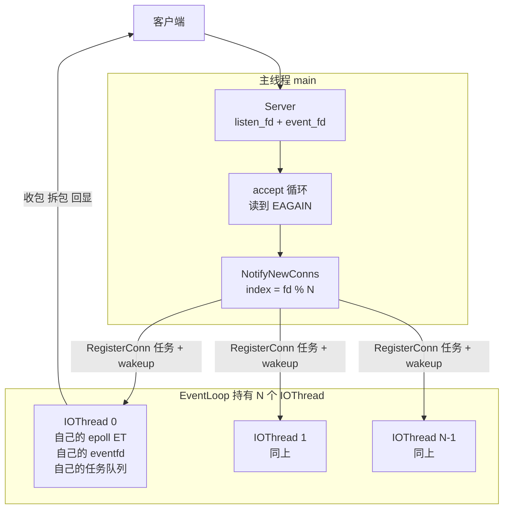
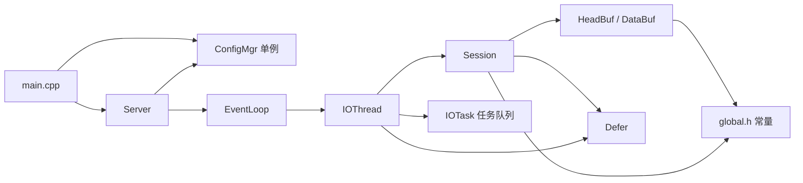
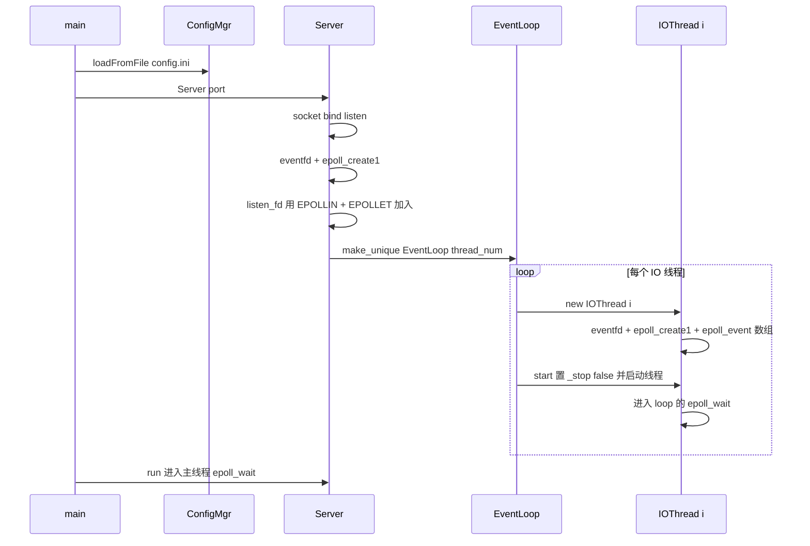
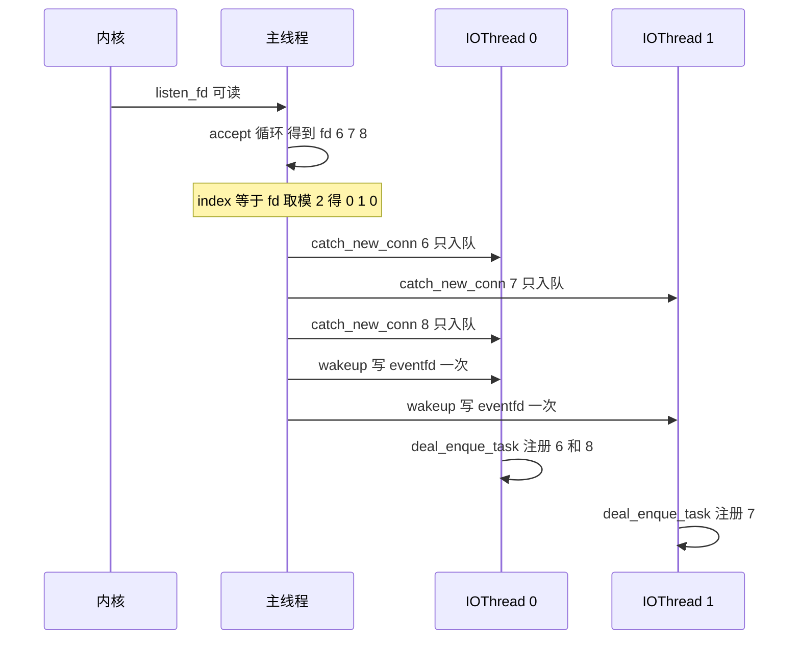
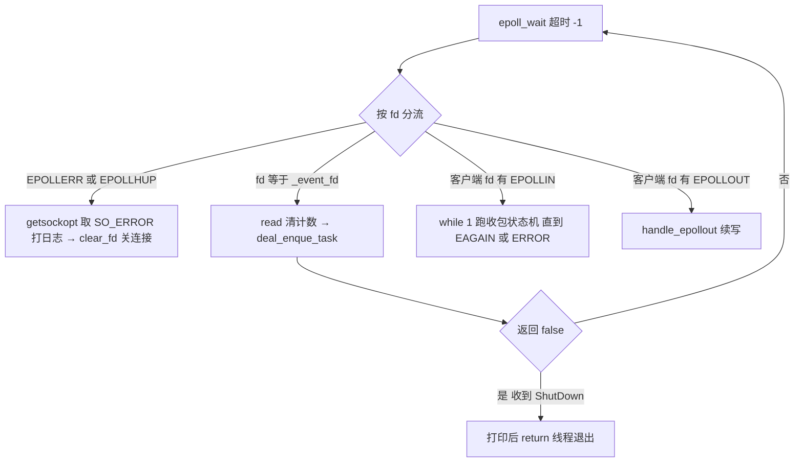
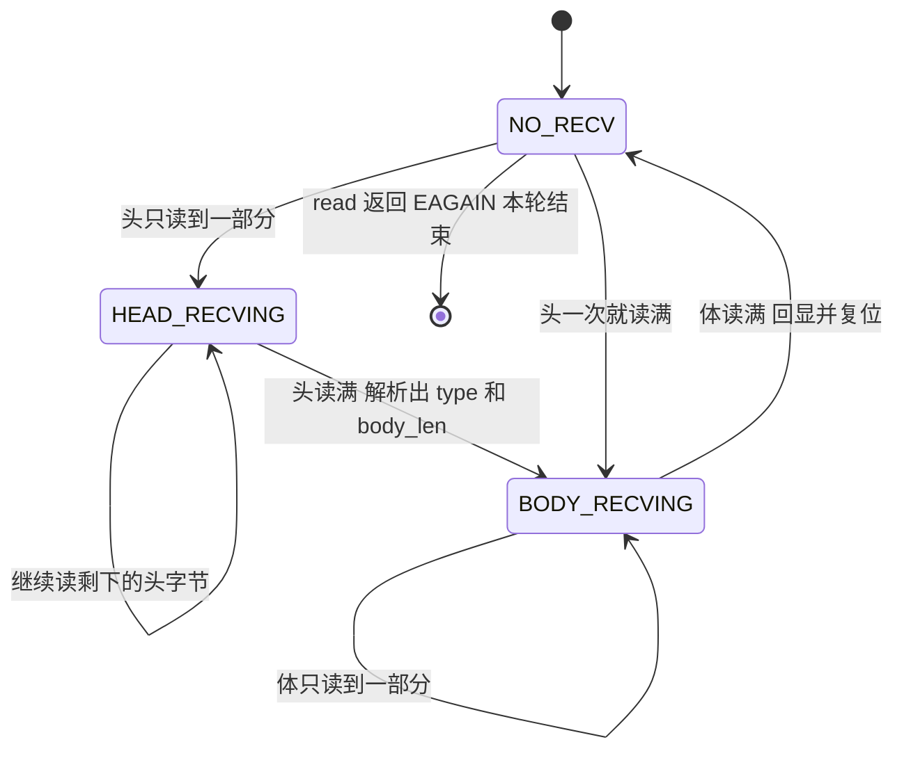
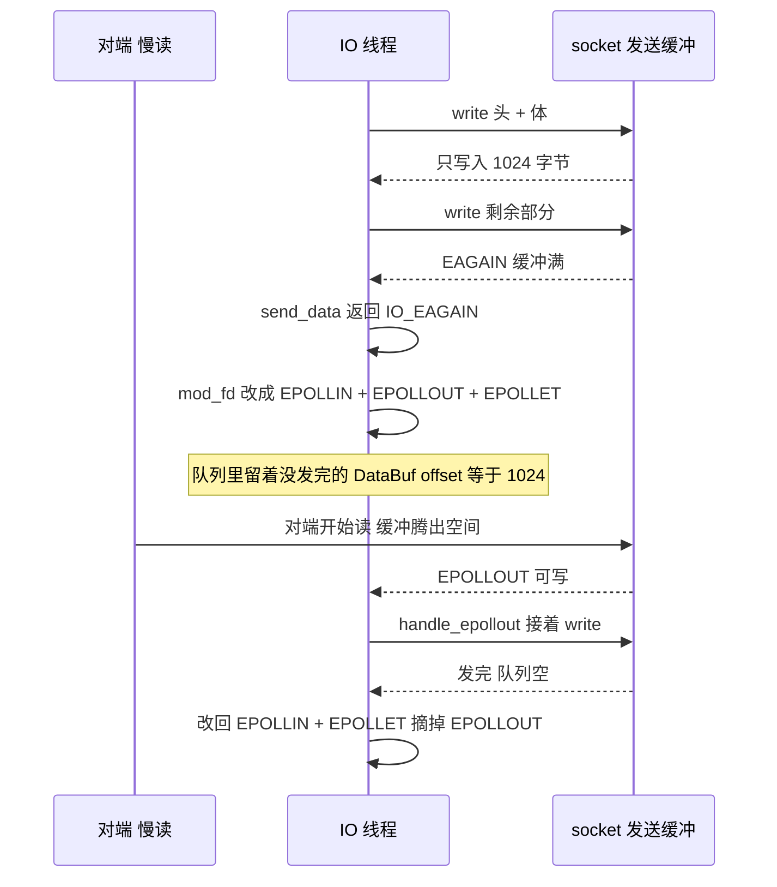
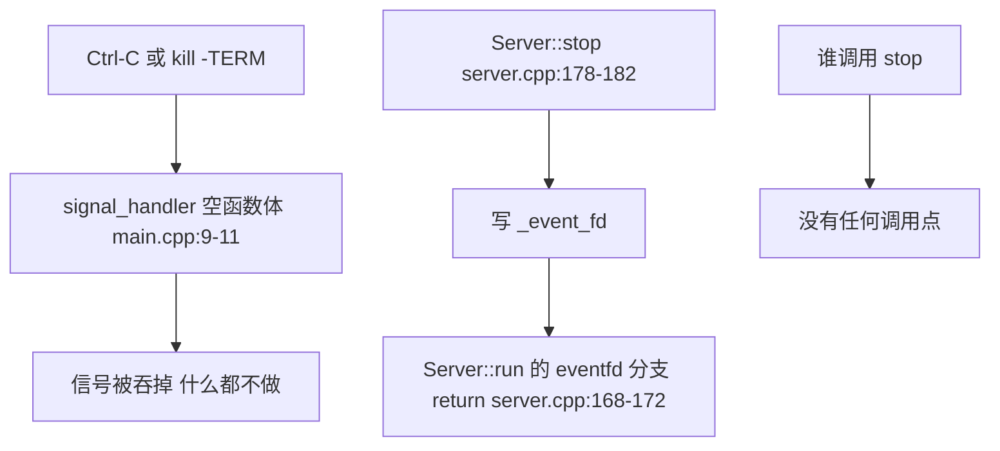
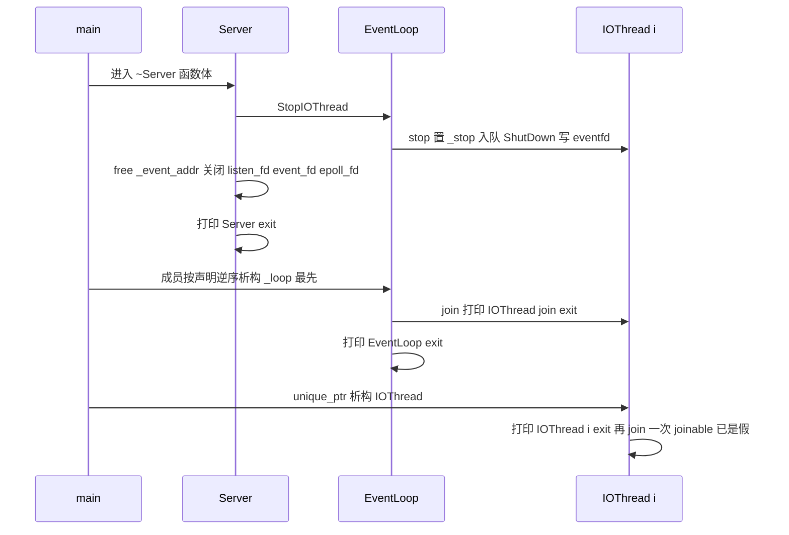

# 23 · Linux 高并发服务器（C++ 版）：架构与流程

> **依据**：对当前工作区 `src/`、`include/`、`CMakeLists.txt`、`CMakePresets.json`、`config.ini` 的逐行静态阅读。文中所有 `文件:行号` 都指向这些文件，例如 `io_thread.cpp:380`。
>
> **验证状态**：本机没有可用的 Linux 工具链（WSL 不可用，MinGW 编译不了 `epoll`/`eventfd`），所以**本文结论全部来自源码静态分析，未经过编译与运行验证**。第 13 章给出在 Linux 虚拟机上逐条验证的方法，以及"每一步应该看到什么"。
>
> **与 `EventLoop-学习笔记/` 的关系**：那套笔记针对的是**更早的一版代码**，与当前 `src/` 有实质出入（第 10 章逐条列出）。本文以当前代码为唯一依据，不复用旧笔记的结论。

**目录**

0. [一分钟看懂](#0-一分钟看懂)
1. [代码地图](#1-代码地图)
2. [线程模型与四条不变量](#2-线程模型与四条不变量)
3. [启动流程](#3-启动流程)
4. [主线程：接入与分发](#4-主线程接入与分发)
5. [IO 线程：单线程事件循环](#5-io-线程单线程事件循环)
6. [接收链路：协议与拆包状态机](#6-接收链路协议与拆包状态机)
7. [发送链路：队列、部分写、EPOLLOUT](#7-发送链路队列部分写epollout)
8. [生命周期与退出](#8-生命周期与退出)
9. [已知问题清单](#9-已知问题清单)
10. [与旧学习笔记的差异](#10-与旧学习笔记的差异)
11. [与 muduo 的对应关系](#11-与-muduo-的对应关系)
12. [行号速查表](#12-行号速查表)
13. [在 Linux 上验收](#13-在-linux-上验收)

---

## 0. 一分钟看懂

一句话：**主线程只做 `accept`，把新连接按 `fd % N` 分给 N 个 IO 线程；每个 IO 线程跑一个自己的 `epoll(ET)` 事件循环，负责读写、拆包、回显；跨线程协作只有一条通道 —— "任务队列 + eventfd 唤醒"。**



读这份代码，只要抓住三条线就够：

| 主线 | 路径 | 关键文件 |
| --- | --- | --- |
| **分发线** | `accept` → `_conn_fds` → `fd % N` → 目标线程任务队列 → `eventfd` 唤醒 → 注册进该线程 epoll | `server.cpp`、`event_loop.cpp` |
| **收包线** | `EPOLLIN` → `read_head_data` → `read_body_data` → 完整包 → `Session::Send` 回显 | `io_thread.cpp`、`session.cpp` |
| **发包线** | `Send` → 发送任务 → 首次直接 `write` → 写不动就订阅 `EPOLLOUT` → `handle_epollout` 续写 → 队列清空后摘掉 `EPOLLOUT` | `io_thread.cpp`、`session.cpp` |

这是典型的 **one loop per thread（muduo 风格的迷你版）**：`Server ≈ Acceptor`、`EventLoop ≈ EventLoopThreadPool`、`IOThread ≈ EventLoop + EventLoopThread`、`Session ≈ TcpConnection`。对照表见第 11 章。

---

## 1. 代码地图

| 文件 | 行数 | 角色 | 关键内容 |
| --- | --- | --- | --- |
| `src/main.cpp` | 35 | 入口 | 读配置 → 构造 `Server` → 注册信号 → `run()` |
| `src/ConfigMgr.cpp` + `include/ConfigMgr.h` | 94 + 43 | ini 解析器（单例） | `[section]` 拍平成 `section:key` 存进 `unordered_map`，模板 `get<T>` 做类型转换 |
| `src/server.cpp` + `include/server.h` | 183 + 43 | **主线程 Reactor** | socket/bind/listen、自己的 epoll、accept 循环、按 fd 分发 |
| `src/event_loop.cpp` + `include/event_loop.h` | 45 + 18 | IOThread 池 | 建 N 个 IOThread、按 fd 选线程、统一停止 |
| `src/io_thread.cpp` + `include/io_thread.h` | **490** + 100 | **核心：事件循环** | epoll 主循环、任务队列、拆包状态机、发送与 EPOLLOUT |
| `src/session.cpp` + `include/session.h` | 125 + 84 | **核心：连接对象** | 收发缓冲、`HeadBuf`/`DataBuf`、协议头拼装、发送队列 |
| `include/global.h` | 12 | 常量 | `BUFF_SIZE 2048`、`HEAD_LEN 4`、四个 IO 返回码 |
| `include/defer.h` | 15 | RAII 小工具 | 析构时执行 lambda，用于状态复位 |
| `CMakeLists.txt` / `CMakePresets.json` / `config.ini` | 63 / 51 / 3 | 构建与配置 | 只链 `Threads::Threads`；把根目录 `*.ini` 拷进 build 目录 |

依赖与持有关系：



谁 new 谁（所有权链）：

| 持有者 | 持有物 | 声明位置 |
| --- | --- | --- |
| `main` 的栈 | `Server server` | `main.cpp:23` |
| `Server` | `_loop` = `shared_ptr<EventLoop>` | `server.h:41` |
| `EventLoop` | `_work_threads` = `vector<unique_ptr<IOThread>>` | `event_loop.h:15` |
| `IOThread` | `_sessions` = `unordered_map<int, shared_ptr<Session>>` | `io_thread.h:97` |
| `Session` | `_head_buf`、`_data_buf`、`_send_que` | `session.h:77-82` |

一句话总结职责边界：**`Server` 只管"把连接交出去"，`IOThread` 管"这条连接的一生"，`Session` 管"这条连接的状态与缓冲"，`EventLoop` 只管"线程池"。**

---

## 2. 线程模型与四条不变量

### 2.1 线程划分

| 线程 | 数量 | 跑什么 | 拥有的 fd |
| --- | --- | --- | --- |
| 主线程 | 1 | `Server::run()` 的 epoll 循环 | `listen_fd`、`Server::_event_fd` |
| IO 线程 | N（当前实际是 2，见 D1） | `IOThread::loop()` | 该线程的 `_event_fd` + 分给它的所有客户端 fd |

主线程不碰任何客户端 fd；IO 线程不碰 `listen_fd`。两边唯一的联系是"任务队列 + eventfd"。

### 2.2 四条不变量（用来判断"这里为什么可以不锁"）

1. **一个连接只属于一个线程。** 新连接在 `NotifyNewConns` 里一次性定好归属线程（`event_loop.cpp:35`），之后所有读写、拆包、关闭都在那个线程内完成（`io_thread.cpp:171-176`）。
2. **`_sessions`、以及 `Session` 的所有字段只被属主线程访问。** 所以 `Session` 里**一把锁都没有**（`session.h:75-82`），`_send_que` 也是无锁队列 —— 这不是漏加锁，而是靠"连接与线程绑定"换来的免锁设计。
3. **线程间唯一共享的可变结构是各 IO 线程的 `_tasks` 队列**，由 `_task_mtx` 保护（`io_thread.h:87-88`、`io_thread.cpp:131-137`）。唤醒靠 `wakeup()` 往 eventfd 写 8 字节（`io_thread.cpp:109-112`）。
4. **`Session::Send()` 是唯一设计成可跨线程调用的入口**（`session.h:69` 注释写明"公开的、线程安全的发送入口"）：它只投递任务，不碰任何连接状态（`session.cpp:68-70`）。

推论：因为 (2)，`Session` 内部不需要锁；因为 (3)(4)，跨线程只需要关心队列的加锁范围和唤醒时机（第 5.2 节会证明它不会丢唤醒）。

> 附带的一条工程习惯：`_sessions` 只在一个线程里增删，所以 `unordered_map` 不需要读写锁 —— 但**前提是不变量 1 成立**。任何"把某个 fd 转交给别的线程"的改造，都会立刻让这条链条失效，必须重新审视全部免锁假设。

---

## 3. 启动流程

### 3.1 逐步说明

1. `main` 拿 `ConfigMgr::Inst()` 单例，`loadFromFile("config.ini")`；打不开就直接返回 1（`main.cpp:14-18`）。注意**工作目录必须是 `config.ini` 所在目录**，CMake 里用 `copy_configs` 把根目录的 `*.ini` 拷进 build 目录（`CMakeLists.txt:36-55`），所以通常要在 build 目录下运行可执行文件。
2. 读端口 `cfg.get<int>("server.port", 12345)`（`main.cpp:20`）——**这一行目前永远拿到默认值 12345**，原因见 D1。
3. 构造 `Server server(port)`（`main.cpp:23`），构造函数做五件事：
   - `create_and_bind`：`socket` → `SO_REUSEADDR` → `bind(INADDR_ANY, port)` → `listen(SOMAXCONN)`（`server.cpp:83-111`）；
   - `set_nonblocking(_listen_fd)`（`server.cpp:10`）——**这行目前没起作用**，见 D2；
   - `_event_fd = eventfd(0, EFD_NONBLOCK)`（`server.cpp:18`），主线程的"门铃"；
   - `epoll_create1` 后把 `listen_fd` 以 `EPOLLIN + EPOLLET`、`event_fd` 以 `EPOLLIN` 加进去（`server.cpp:36-54`）；
   - 按配置的线程数构造 `EventLoop`（`server.cpp:63-66`）——**这里也永远拿到默认值 2**。
4. `EventLoop` 构造函数（`event_loop.cpp:4-14`）：循环 N 次，每次 `make_unique<IOThread>(i)` → `t->start()` → 放进 `_work_threads`。
5. `IOThread` 构造函数（`io_thread.cpp:5-34`）：建自己的 `eventfd`（`EFD_NONBLOCK`）→ 建自己的 `epoll_create1` → 把 eventfd 加进自己的 epoll → `malloc` 一个容量 1024 的 `epoll_event` 数组。
6. `IOThread::start`（`io_thread.cpp:102-107`）：先把 `_stop` 置 false，再启动线程，线程体就是 `loop()`。
7. 回到 `main`：`g_server = &server`（设了但没人读，见 D3）、注册 SIGINT/SIGTERM（handler 是空函数，见 D3）、进入 `server.run()`。

### 3.2 启动时序图



### 3.3 启动后立刻能观察到的现象

| 输出 | 来自 | 说明 |
| --- | --- | --- |
| `server.port = 12345` | `main.cpp:21` | 因为 D1，永远是默认值，不是 `config.ini` 里的值 |
| `server _listen_fd is 3` | `server.cpp:16` | 具体数字取决于进程已打开的 fd |
| `server _event_fd is 4` | `server.cpp:26` | 主线程门铃 |
| `server _epoll_fd is 5` | `server.cpp:34` | 主线程 epoll 实例 |
| `construt event_loop num is 2` | `event_loop.cpp:7` | 注意拼写是 `construt`；数字是**默认值 2**，不是 `config.ini` 的 4 |

线程数可以用 `top -H -p <pid>` 或 `ls /proc/<pid>/task` 验证：应当是 **1 个主线程 + 2 个 IO 线程**，而不是 `config.ini` 里写的 4 个。

---

## 4. 主线程：接入与分发

### 4.1 主线程的 epoll 里只有两个 fd

| fd | 注册的事件 | 出现时做什么 | 位置 |
| --- | --- | --- | --- |
| `_listen_fd` | `EPOLLIN + EPOLLET` | accept 循环 → 收集到 `_conn_fds` → 分发 | `server.cpp:36-44`、`142-166` |
| `_event_fd` | `EPOLLIN` | `read` 清计数 → 打印 `receive exit eventfd` → `run()` 返回 | `server.cpp:46-54`、`168-173` |

主线程**完全不碰客户端 fd**：新连接只被"收下来、交出去"。这也是 D2（`listen_fd` 仍是阻塞的）后果严重的根因 —— 主线程被 `accept` 挂住时，连 `_event_fd` 都轮不到处理。

### 4.2 accept 循环

`server.cpp:145-163` 的骨架，逐句：

```cpp
while(1){
    int conn_fd = accept(_listen_fd, (sockaddr *)&cli, &len);
    if(conn_fd < 0){
        if(errno == EAGAIN || errno == EWOULDBLOCK) break; // 队列空：ET 下的正常出口
        if(errno == EINTR) continue;                       // 被信号打断：重试
        perror("accept"); break;                           // 真错误（EMFILE 未单独处理，见 D10）
    }
    _conn_fds.push_back(conn_fd);
    printf("Accepted fd=%d\n", conn_fd);
}
if(!_conn_fds.empty()){ _loop->NotifyNewConns(_conn_fds); _conn_fds.clear(); }
```

- ET 下 `listen_fd` 可读意味着"accept 队列可能还没空"，所以必须循环到 `EAGAIN` 才能 `break` —— 骨架本身是对的。
- `_conn_fds` 是"攒一批再交出去"的缓冲：一次 epoll 事件里 accept 到的所有连接统一分发，分发端再做批量唤醒（4.3）。
- 但 `listen_fd` 实际仍是阻塞的（D2），所以第 2 次 `accept` 会挂在主线程里，`EAGAIN` 出口永远走不到。表现为"功能看着正常（阻塞的 accept 会等到下一个连接），但主线程被占死"。

### 4.3 分发：fd % N 与批量唤醒

`EventLoop::NotifyNewConns(std::vector<int>&)`（`event_loop.cpp:31-44`）做四件事：

```cpp
for (int i = 0; i < conns.size(); i++) {
    auto fd = conns[i];
    auto index = fd % _work_threads.size();   // ① 选线程
    _work_threads[index]->catch_new_conn(fd); // ② 只入队，不唤醒
    notify_threads.insert(index);             // ③ 记录涉及到的线程
}
for (auto idx : notify_threads) _work_threads[idx]->wakeup(); // ④ 每个线程只唤醒一次
```

- ②`IOThread::catch_new_conn` 只加锁 `push`，**故意不唤醒**（`io_thread.cpp:149-155`）；唤醒集中在 ④。
- ④用 `unordered_set` 去重：3 个新连接落在 2 个线程上只写 2 次 eventfd，而不是 3 次。
- 分发用 `fd % N`：零成本、无状态，而且**天然满足"同一个 fd 永远映射到同一个线程"**（不变量 1 的来源）。代价是负载不可控 —— fd 由内核回收复用，活跃连接数分布会偏斜。`EventLoop::_next_idx`（`event_loop.h:16`）看着像准备做轮询分发，实际没有任何引用（死代码，见 D6）。



---

## 5. IO 线程：单线程事件循环

### 5.1 loop 的分流结构

`IOThread::loop`（`io_thread.cpp:380-490`）：



三个细节：

1. **分流顺序有坑**：`EPOLLERR|EPOLLHUP` 判断（410）排在 `fd == _event_fd`（418）之前，所以 eventfd 一旦报错会被当普通连接 `clear_fd` 关掉，此后该线程再也无法被唤醒（D8）。
2. **EPOLLIN 用 `while(1)` 读到 `EAGAIN`**（437-475）：ET 的硬性要求，半包/粘包都靠它。
3. **同一 fd 同时有 IN 和 OUT 时先收后发**（436 在 478 之前）：先把数据读完，再处理发送积压。

### 5.2 任务队列：怎么做到不丢唤醒

| 投递函数 | 加锁 push | 唤醒 | 用途 |
| --- | --- | --- | --- |
| `enqueue_task`（`io_thread.cpp:131-137`） | ✅ | ✅ | 通用投递 |
| `catch_new_conn`（149-155） | ✅ | ❌ 故意 | 批量分发，由 `NotifyNewConns` 统一唤醒 |

消费侧 `deal_enque_task`（160-214）先 `swap` 出整个队列，**锁内只做交换**，出锁后再逐条执行慢操作：

```cpp
std::queue<std::shared_ptr<IOTask>> q;
{
    std::lock_guard<std::mutex> lk(_task_mtx);
    std::swap(q, _tasks);   // 锁内只有这一次交换
}
while(!q.empty()){ /* 注册连接、写 socket 都在锁外 */ }
```

**为什么不丢唤醒**：消费侧的顺序是"先 `read(eventfd)` 清计数（420），再 `swap` 取队列（164）"。

- push 发生在 swap 之前 → 任务一定被这次 swap 取走；
- push 发生在 swap 之后 → 投递方也写了 eventfd，计数非零，`epoll_wait` 会再返回一次。

两种交错都安全，不需要额外的双检逻辑。

### 5.3 三类任务

| 任务 | 谁投递 | 处理 | 位置 |
| --- | --- | --- | --- |
| `RegisterConn` | 主线程 `NotifyNewConns` | 建 `Session` 存进 `_sessions` → `set_nonblocking` → `add_fd(EPOLLIN + EPOLLET)` | `io_thread.cpp:171-176` |
| `SendData` | `Session::Send` | 找 `Session`（找不到就丢弃）→ 造 `DataBuf`（头 + 体）→ `send_data` 直发；`EAGAIN` 则追加 `EPOLLOUT` | `io_thread.cpp:179-205` |
| `ShutDown` | `EventLoop::StopIOThread` | `return false` → `loop` 退出 | `io_thread.cpp:208-210` |

注意：`RegisterConn` 里的 `set_nonblocking(task->_fd)`（174）是**带 `O_NONBLOCK` 的正确实现**（`io_thread.cpp:93-97`），与 `Server` 里那份漏了标志位的同名函数（`server.cpp:113-117`）是两份不同代码（D2）。

---

## 6. 接收链路：客户端发来消息，服务端每一步做了什么

### 6.1 协议格式

| 字段 | 偏移 | 长度 | 说明 |
| --- | --- | --- | --- |
| `msg_type` | 0 | 2 | 消息类型，网络字节序 |
| `body_len` | 2 | 2 | 包体长度，网络字节序 |
| `body` | 4 | `body_len` | 载荷，接收端要求 ≤ `BUFF_SIZE` = 2048 |

- 拼头在发送侧：`session.cpp:39-43`；解析在接收侧：`io_thread.cpp:259-270`。
- `HEAD_ID_LEN(2) + HEAD_LEN_LEN(2) = HEAD_LEN(4)`（`global.h:3-6`），这两个细分宏本身没有被引用（D6）。
- 协议没有 magic、版本、校验和；唯一的入站防护是 `body_len > BUFF_SIZE` 判错（`io_thread.cpp:267`），而发送侧连这个都没有（D9）。

### 6.2 状态机



| 状态 | 含义 | 相关缓冲 |
| --- | --- | --- |
| `NO_RECV` | 一个包的开始 | `_head_buf` 可用，`_data_buf == nullptr` |
| `HEAD_RECVING` | 头读了一部分（offset 1~3） | `_head_buf->_offset` 记进度 |
| `BODY_RECVING` | 头已读满，正在读体 | `_data_buf` 已按 `body_len` 分配 |

### 6.3 返回码语义

| 返回码 | 值 | 含义 | 调用方动作 |
| --- | --- | --- | --- |
| `IO_CONTINUE` | 2 | 有进展，继续读 | `continue`，同一轮里接着读 |
| `IO_EAGAIN` | 1 | 数据读空，等下一次 `EPOLLIN` | `break`，退出 `while(1)` |
| `IO_ERROR` | -1 | 真错误或对端关闭 | `clear_fd(fd)` + `break` |
| `IO_SUCCESS` | 0 | 仅发送路径使用 | — |

`EINTR` 在收头/收体里都映射成 `IO_CONTINUE`（重试一次）：`io_thread.cpp:232-234`、`290-293`。

### 6.4 端到端：从 EPOLLIN 到"回显被投递"

前置：连接已注册完成（`_sessions[fd]` 有 `Session`，epoll 上挂 `EPOLLIN + EPOLLET`）。设客户端发来 `03 E9 00 02 68 69`（type=1001、body=`hi`）。

| # | 方法 / 系统调用 | 位置 | 调用者 | 做什么 | 结果 |
| --- | --- | --- | --- | --- | --- |
| 1 | `epoll_wait` | `io_thread.cpp:382` | `IOThread::loop` | 该 socket 由"无数据"变"有数据"，ET 上报一次 | `nfds ≥ 1`，`events = EPOLLIN` |
| 2 | `IOThread::loop` | 380-490 | 线程体 | 遍历事件；非错误、非 eventfd → 走客户端分支 | — |
| 3 | `unordered_map::find` | 432 | `loop` | 按 fd 查 `_sessions` | `auto sess = iter->second` 是 `shared_ptr` 拷贝，引用计数 +1，保证回调期间 `Session` 不被释放 |
| 4 | `IOThread::read_head_data(std::shared_ptr<Session>)` | 219-277 | `loop` | 读 4 字节头 | 见 4a~4e |
| 4a | `::read` | 225 | `read_head_data` | 只读"缺的那部分头"：`remain = 4 - offset` | 返回 4 |
| 4b | `memcpy` ×2 + `ntohs` ×2 | 261-264 | 同上 | 从 `_head_buf` 取出 type/len 并转主机序 | `msg_type=1001`、`body_len=2` |
| 4c | 长度校验 | 267-270 | 同上 | `body_len > BUFF_SIZE` → `IO_ERROR` | 通过 |
| 4d | `std::make_shared<DataBuf>(msg_type, body_len)` → `DataBuf::DataBuf(uint16_t, size_t)` | 275 → `session.cpp:22-29` | 同上 | 接收用构造：`malloc(body_len)` | `_data_buf` 就位 |
| 4e | 状态迁移 | 273-274 | 同上 | `_recv_stage = BODY_RECVING`；`_head_buf->_offset += read_len`（变 4） | `return IO_CONTINUE` |
| 5 | `loop` 里的 `continue` | 442-443 | `loop` | `IO_CONTINUE` 不返回 `epoll_wait`，直接重进 `while(1)` | — |
| 6 | `IOThread::read_body_data(std::shared_ptr<Session>)` | 279-325 | `loop` | 读 body | 见 6a~6e |
| 6a | `::read` | 283 | `read_body_data` | 读到 `_data_buf->_buf + offset` | 返回 2 |
| 6b | 偏移推进 | 306 | 同上 | `_offset += read_len` | `offset == _data_len` → 读满 |
| 6c | `std::string(_buf, _data_len)` | 314 | 同上 | body 拷成 string（每包一次拷贝） | — |
| 6d | `Session::Send(str, _type)` | 315 → `session.cpp:68-70` | 同上 | 应用层发送入口（第 7 章） | — |
| 6e | 状态复位 | 318-321 | 同上 | `_data_buf = nullptr`（引用计数归零 → `DataBuf::~DataBuf` → `free`）、`_recv_stage = NO_RECV`、`memset` 头缓冲、`_head_buf->_offset = 0` | `return IO_CONTINUE` |
| 7 | `loop` 的 `while(1)` 再循环 | 437-475 | `loop` | 再调 `read_head_data`；`::read` 返回 `-1/EAGAIN` → `IO_EAGAIN` | `break`，回到 `epoll_wait` |

两个容易忽略的点：

- 第 5 步的 `continue` 是"粘包"能处理的原因：一轮里把所有完整包全部处理完，直到 `read` 返回 `EAGAIN`。
- 第 6b 步的 `offset` 是唯一的进度真相；`read_body_data` 每次只请求"还缺的字节数"，所以不会有重复读/丢字节。

### 6.5 半包与粘包的具体例子

**半包**（客户端分三次发 `03 E9 00`、`02 68`、`69`）：

| 客户端发出 | 服务端动作 | 状态变化 |
| --- | --- | --- |
| `03 E9 00` | 收头 `remain=4` 读到 3 → `IO_CONTINUE` | `NO_RECV → HEAD_RECVING`，`offset=3` |
| `02 68` | 收头 `remain=1` 读到 `02` → 头满，`body_len=2` → `IO_CONTINUE` | `HEAD_RECVING → BODY_RECVING`，分配 `DataBuf(2)` |
| （下一轮） | 收体 `remain=2` 读到 `68` → `IO_CONTINUE` | `offset=1` |
| `69` | 收体 `remain=1` 读到 `69` → 读满 → 回显 | `BODY_RECVING → NO_RECV` |

第三个写 `02 68` 被内核拆成"头 1 字节 + 体 1 字节"，服务端靠状态机接住了 —— 这就是"TCP 是字节流，消息边界必须应用层重建"。

**粘包**：客户端一次发出 `03 E9 00 02 68 69` + `03 EA 00 02 6F 6B`，同一轮 `while(1)` 里走完"收头 → 收体 → 回显 → 复位 → 收头 → 收体 → 回显 → 复位 → EAGAIN"，回出两个包（1001、1002）。

---

## 7. 发送链路：回显是怎么发出去的

### 7.1 端到端：从 `Send` 到字节写入 socket

| # | 方法 / 系统调用 | 位置 | 调用者 | 做什么 |
| --- | --- | --- | --- | --- |
| 1 | `Session::Send(std::string, int)` | `session.cpp:68-70` | `read_body_data` | 唯一线程安全入口；转交 `_p_ownerthread->enqueue_send_data(_fd, data, msg_type)` |
| 2 | `IOThread::enqueue_send_data(int, const std::string&, int)` | `io_thread.cpp:144-147` | `Session::Send` | 造任务 |
| 3 | `IOTask::IOTask(int, TaskType, std::string, int)` | `io_thread.h:32-33` | `enqueue_send_data` | 存 fd、类型、数据、msgtype（`_data` 是 `std::string` 拷贝） |
| 4 | `IOThread::enqueue_task(shared_ptr<IOTask>)` | 131-137 | `enqueue_send_data` | 锁内 `_tasks.push(task)` |
| 5 | `IOThread::wakeup()` | 109-112 | `enqueue_task` | `write(_event_fd, 1, 8)` 写自己的门铃 |
| 6 | `epoll_wait` | 382 | `loop` | 因 eventfd 可读返回 |
| 7 | `::read` | 420 | `loop` | 读走 8 字节，清空计数 |
| 8 | `IOThread::deal_enque_task()` | 160-214 | `loop` | 锁内 `swap` 取走全部任务，出锁逐条执行 |
| 9 | `std::make_shared<DataBuf>(type, data, size)` → `DataBuf::DataBuf(uint16_t, std::string, size_t)` | 183 → `session.cpp:31-44` | `deal_enque_task` | 发送用构造：`_data_len = size + 4`，`htons(type)`/`htons(size)`，`memcpy` 拼成"头 + 体" |
| 10 | `Session::send_data(shared_ptr<DataBuf>)` | `session.cpp:76-125` | `deal_enque_task` | 真正写 socket（7.2） |
| 11 | `Defer::Defer` / `Defer::~Defer` | `defer.h:7` / `8-10` | `send_data` | 保证退出时 `_send_stage` 复位成 `NO_SEND` |
| 12 | `std::queue::push` / `front` / `pop` | `session.cpp:83` / `85` / `118` | `send_data` | 队列管理：新数据入队、从队首写、写满才出队 |
| 13 | `::write` | `session.cpp:87` | `send_data` | 真写内核发送缓冲 |
| 14 | `IOThread::mod_fd(int, int)` | `io_thread.cpp:66-77` | `deal_enque_task:200` | `EPOLL_CTL_MOD` 追加 `EPOLLOUT` |
| 15 | `IOThread::handle_epollout(shared_ptr<Session>)` | 330-376 | `loop:483` | 可写时续写积压数据 |
| 16 | `IOThread::clear_fd(int)` | 87-91 | `handle_epollout` 出错/对端关闭时 | `_sessions.erase` + `del_fd` + `close` |

### 7.2 `Session::send_data` 逐行要点（76-125）

```cpp
_send_stage = SENDING;
Defer defer([this](){ this->_send_stage = NO_SEND; });  // 任何 return 都会复位
_send_que.push(data);                                   // 新数据排到队尾 → 保序
while(!_send_que.empty()){
    auto msg = _send_que.front();
    while(msg->_offset < msg->_data_len){
        auto w = write(_fd, msg->_buf + msg->_offset, msg->_data_len - msg->_offset);
        if(w > 0){ msg->_offset += w; continue; }        // 部分写：推进偏移继续
        if(w < 0){
            if(errno == EAGAIN || errno == EWOULDBLOCK) return IO_EAGAIN; // 缓冲满
            if(errno == EINTR) continue;                                  // 重试
            perror("send failed: "); return IO_ERROR;                      // 真错误
        }
        if(w == 0){ return IO_ERROR; }                   // 对端关闭
    }
    _send_que.pop();                                     // 只有发满才出队
}
return IO_SUCCESS;
```

- **为什么先 push 再循环**：即使队列里还有上次没发完的数据，新消息也只是排到后面，不会插队 —— 保序的第一道保障。
- **为什么用 `_offset` 而不删已发部分**：部分写后缓冲区原地复用，下次接着从偏移处写，零拷贝。
- **`_send_stage` 实际上是死状态**：`send_data` 是同步函数，`Defer` 在返回前一定复位成 `NO_SEND`，所以 `io_thread.cpp:184` 的 `if(_send_stage == SENDING)` 永远为假；`io_thread.cpp:479` 的同类判断也一样（D6）。因为两个写入口共用同一个队列，这个死分支不影响正确性。

### 7.3 部分写与 EPOLLOUT 生命周期



- **只有真写不动才订阅 `EPOLLOUT`**（`io_thread.cpp:199-201`）：正常发完的连接不会因为"可写"被反复唤醒。
- `handle_epollout` 在 `EAGAIN` 时直接 `return`，**保留** `EPOLLOUT`（349-352）；队列清空时用 `epoll_ctl(MOD)` 改回 `EPOLLIN + EPOLLET`（372-375，返回值未检查）。
- 用 ET 时，"挂着 `EPOLLOUT` 且缓冲可写"不会自旋（只在"写不动 → 可写"的跳变上报一次），所以"发完就摘"更多是为了让监听集合精确反映状态、减少无谓唤醒；如果换成 LT，摘掉就是必需的。
- `deal_enque_task` 处理返回值（191-205）：`-1` → `erase + del_fd + close`（重复实现了 `clear_fd` 的逻辑，D15）；`1` → `mod_fd` 追加 `EPOLLOUT`；`0` → 什么也不做。

### 7.4 回显为什么要多绕一跳

回显发生在**拥有该连接的线程内部**，但 `Session::Send` 的实现是"投递任务"，于是：

```
read_body_data → Session::Send → enqueue_send_data → 加锁入队 + 写自己的 eventfd
              → epoll_wait 再返回一次 → deal_enque_task → send_data 真正 write
```

| 好处 | 代价 |
| --- | --- |
| 代码路径统一：不管从哪个线程调用 `Send` 都安全，所有写操作天然串行在属主线程 | 每个回显包多一次 eventfd 往返（多一次 `epoll_wait` 返回） |

优化方向（留作练习）：在 `Send` 里判断"当前线程是否就是属主线程"（`thread_local` 标识或比较线程 id），是则直接调用 `send_data`，否则才走队列 —— 回显路径可以省掉这一跳。

---

## 8. 生命周期与退出

### 8.1 当前代码没有任何路径能正常退出（重要结论）



- `signal_handler` 是空函数（`main.cpp:9-11`）：SIGINT/SIGTERM 被安装成"忽略"，Ctrl-C 和 `kill` 都不会触发任何逻辑；`g_server`（`main.cpp:6`、`25`）赋值后再没被读过。
- `Server::run()` 唯一可能 `return` 的分支是"`_event_fd` 可读"（`server.cpp:168-172`），而唯一写这个 eventfd 的 `Server::stop()` 是死代码。
- 又因为 `listen_fd` 实际是阻塞的（D2），主线程大概率停在 `accept` 里，连 epoll 都不在等。
- 结论：**实践中只能用 `kill -9`**。`SO_REUSEADDR`（`server.cpp:92`）保证重启时不会卡在 `TIME_WAIT`。

### 8.2 如果能走到析构，顺序是这样的



关键认知：

- 成员析构顺序与声明顺序相反，`_loop` 是 `Server` 最后一个成员（`server.h:41`），所以它最先析构 —— 打印顺序必然是 `Server exit` → `IOThread join exit` → `EventLoop exit` → `IOThread 【i】exit`。
- `~Server` 里的 `StopIOThread()` 是**必需**的：不先让 IO 线程"有路可退"，`~EventLoop` 里的 `join()` 会永远挂住（线程还阻塞在 `epoll_wait`）。这是多线程服务器最常见的退出 bug。
- `IOThread` 的退出机制本身是完整的：`stop()` 置标志 + 入队 ShutDown + 写 eventfd（`io_thread.cpp:114-118`）→ `loop` 收到 ShutDown 后 `return`（423-427）→ `~IOThread` `close/free` 后 `join`（36-42）。

### 8.3 资源所有权

| 资源 | 分配 | 释放 | 现状 |
| --- | --- | --- | --- |
| `Server::_listen_fd` / `_event_fd` / `_epoll_fd` | `Server` 构造函数 | `~Server` 函数体 `close` | ✅ |
| `Server::_event_addr` | `malloc`（`server.cpp:57`） | `~Server` `free`（71-74） | ✅ |
| `IOThread::_event_fd` / `_epoll_fd` / `_event_addr` | `IOThread` 构造函数 | `~IOThread`（`io_thread.cpp:36-42`） | ✅（但顺序见 D12） |
| 客户端 fd | 主线程 `accept` | `clear_fd` 里 `close` | ⚠️ 退出时不遍历 `_sessions` 关闭（D16） |
| `Session` / `HeadBuf` / `DataBuf` | `make_shared` / `malloc` | 引用计数归零时 | ✅ |
| `_send_que` 里没发完的数据 | `make_shared` | `Session` 销毁时随队列释放 | ✅ |

---

## 9. 已知问题清单

严重度：🔴 影响功能正确性 / 🟡 健壮性与代码质量 / ⚪ 细节与一致性。**前四条（D1~D4）是当前代码最要紧的问题**，其中 D1、D2 在旧学习笔记里完全没有提到。

| 编号 | 级别 | 位置 | 现象与原因 | 验证方法 | 修法建议 |
| --- | --- | --- | --- | --- | --- |
| D1 | 🔴 | `ConfigMgr.cpp:53-56` vs `main.cpp:20`、`server.cpp:64` | **配置项全部读不到。** `loadFromFile` 把键拍平成 `section:key`（冒号），调用方查的却是 `server.port`、`server.thread_num`（点号），`_kv.find` 失败 → 一律返回默认值。于是端口永远是 12345、线程数永远是 2（`config.ini` 写的是 4） | 把 `config.ini` 的 port 改成 23456，启动日志仍打印 `server.port = 12345`；`ls /proc/<pid>/task` 只有 3 个线程 | 分隔符统一成 `.`（改 `ConfigMgr.cpp:54`），或在调用方改用 `server:port`；建议启动时打印实际生效的配置 |
| D2 | 🔴 | `server.cpp:113-117` | **`listen_fd` 其实还是阻塞的。** `return fcntl(fd, F_SETFL, flags)` 少了 `\| O_NONBLOCK`（对照 `io_thread.cpp:93-97` 的正确写法）。ET 语义下必须"accept 到 EAGAIN"，而阻塞 socket 的第二次 `accept` 会挂住主线程；`EAGAIN`/`EINTR` 分支形同虚设，`eventfd` 停止信号也轮不到处理 | `strace -f -e trace=accept,epoll_wait ./event_server`，连一个客户端后主线程卡在 `accept` 而不是 `epoll_wait` | `fcntl(fd, F_SETFL, flags \| O_NONBLOCK)` |
| D3 | 🔴 | `main.cpp:9-11`、`main.cpp:6/25`、`server.cpp:178-182` | **没有任何可用的停止路径。** `signal_handler` 空实现，SIGINT/SIGTERM 被吞；`g_server` 写了不读；`Server::stop()` 无调用点；`run()` 因此永不返回，析构与优雅退出都走不到 | Ctrl-C 无反应，`kill -TERM <pid>` 也无反应，只能 `kill -9` | handler 里只做异步安全操作：写 self-pipe/eventfd 或置 `volatile sig_atomic_t` 标志，主循环检查后调用 `stop()` |
| D4 | 🔴 | `io_thread.cpp:275`、`281-303` | **`body_len == 0` 的包会被当成"对端关闭"而断开连接。** `read_head_data` 只拦 `> BUFF_SIZE`（267），0 长度照样分配 `DataBuf`，`_data_len = 0`；下一轮 `read_body_data` 里 `remain = 0`，`read(fd, buf, 0)` 按 POSIX 返回 0 → 落到"对端关闭"分支返回 `IO_ERROR` → `clear_fd` | `python3 EventLoop-学习笔记/echo_client.py zero`（该用例发 `type=5001, len=0`） | `read_head_data` 里对 `body_len == 0` 直接判定"包已完整"（回显 + 复位状态），不要进入 `BODY_RECVING` |
| D5 | 🟡 | `io_thread.cpp:390-404` | **扩容判断写错对象。** `if(!new_count)` 判的是"新容量为 0"（恒假），应该判 `new_addr`；`realloc` 失败时 `new_addr == NULL`，代码却执行 `_event_addr = new_addr`（398），之后 `epoll_wait` 拿到空指针 → `EFAULT` → 线程退出。另外 `_expanded_once` 使扩容只发生一次，`realloc` 失败还会丢掉原指针（泄漏） | 代码阅读；可用 `LD_PRELOAD` 或 `ulimit -v` 制造 `realloc` 失败 | 判 `new_addr`，失败时保留旧数组；去掉一次性扩容限制；改用 `std::vector` |
| D6 | 🟡 | 多处 | **死代码与永远为假的判断。** `EventLoop::_next_idx`（`event_loop.h:16`）、`IOThread::enqueue_new_conn`（`io_thread.cpp:139-142`）、`HEAD_ID_LEN`/`HEAD_LEN_LEN`、`Server::_port`、`ConfigMgr::hasKey` 均无引用；`io_thread.cpp:184` 与 `479` 的 `_send_stage == SENDING` 因 `Defer` 同步复位而恒假；`io_thread.cpp:454-455`、`472-473` 也是死分支（`read_*` 的返回值已被穷举） | 全局搜索引用名 | 删除，或按原意补全（`_next_idx` 做真正的轮询分发、`_send_stage` 做真正的重入保护） |
| D7 | 🟡 | `io_thread.cpp:242-246` | 对端关闭处写的是字面量 `return -1`，而不是 `IO_ERROR`；值相同、语义不统一，后续改宏值会踩坑 | 代码阅读 | 统一用 `IO_ERROR` |
| D8 | 🟡 | `io_thread.cpp:410-416` | **`EPOLLERR/EPOLLHUP` 分支对任何 fd 都 `clear_fd`。** 若 eventfd 报错会被 `del_fd + close`，此后该线程永远无法被唤醒，跨线程投递全部失效。主线程的同类分支只打印不处理（`server.cpp:135-140`），两处行为不一致 | 极难自然复现 | 该分支先判 `fd == _event_fd`，是则只打日志、不关闭 |
| D9 | 🟡 | `session.cpp:39-43`、`session.h:69` | **发送侧不校验长度。** `htons(data_len)` 在 `data_len > 65535` 时静默截断；也没有与接收端 `BUFF_SIZE` 对齐的校验。`Session::Send` 是 public 入口，任何调用方传入超长 body 都会产生"头里长度 ≠ 实际 body"的畸形包 | 调 `Send(std::string(70000, 'a'), 1)` | `Send`/`DataBuf` 构造里加 `data_len > 0xFFFF` 与 `> BUFF_SIZE` 的检查；超长按分片或拒绝 |
| D10 | 🟡 | `server.cpp:147-154` | **未处理 fd 耗尽（`EMFILE`/`ENFILE`）。** 只 `perror` + `break`，listen fd 上的可读事件没被消费，ET 下会造成"连接堆积但不再 accept"；也没有连接数上限/限流 | `ulimit -n 64` 后狂连 | 预留一个空闲 fd，`EMFILE` 时先 `close` 它再 `accept` 并立刻关闭该连接；加连接数上限 |
| D11 | 🟡 | `server.cpp:123`、`io_thread.cpp:382` | **没有超时、心跳、空闲回收、`TCP_NODELAY`、优雅关闭。** `epoll_wait` 超时写死 `-1`，没有定时器 | 连上后不发数据，观察连接永不回收 | 引入定时器轮/最小堆 + `epoll_wait` 超时扫描；`setsockopt(TCP_NODELAY)` |
| D12 | ⚪ | `io_thread.cpp:36-42` | **析构顺序风险**：先 `close(_event_fd)`、`close(_epoll_fd)`、`free(_event_addr)`，最后才 `join()`。若线程没被 `stop()` 直接析构，就先关掉了它正在使用的 fd。当前调用路径上 `~EventLoop` 已先 `join` 过，所以安全；`~IOThread` 与 `~EventLoop` 重复 `join` 也无害（`joinable()` 兜底） | 代码阅读 | 先 `join` 再 `close/free` |
| D13 | ⚪ | `ConfigMgr.cpp:65-78`、`event_loop.cpp:35` | **健壮性**：`std::stoi/stol/stod` 遇非法值抛异常且无人捕获 → `terminate`；`thread_num` 没做 `> 0` 校验，若配成 0 则 `fd % _work_threads.size()` 会除零 | 在 `config.ini` 写 `port = abc`；或把线程数改成 0 | `try/catch` 回退默认值；对 `thread_num` 做下限 clamp |
| D14 | ⚪ | `event_loop.cpp:33`、`io_thread.cpp:223/281/390/406` | 编译告警：有符号/无符号比较、`size_t → int` 窄化、`read/write` 返回值未使用（`io_thread.cpp:111`、`420`） | `g++ -Wall -Wextra` 编译 | 统一用 `size_t`/显式 `static_cast`；按 `CMakePresets.json` 的告警开关加 `-Werror` 修干净 |
| D15 | ⚪ | `io_thread.cpp:47-64`、`191-195` | 一致性：`SendData` 出错时手写 `erase + del_fd + close`（191-195），重复了 `clear_fd` 的实现；`add_fd` 在 `EPOLL_CTL_ADD` 失败时先 `perror` 再尝试 `MOD`（56），正常路径也会打印一行"错误"，容易误判；`epoll_event ev` 未清零（`server.cpp:37`、`io_thread.cpp:48`） | 代码阅读 | 统一走 `clear_fd`；把 `perror` 改成只在 MOD 也失败时打印；用 `epoll_event ev{}` |
| D16 | ⚪ | `io_thread.cpp:36-42`、`server.cpp:69-81` | 退出时不遍历 `_sessions` 关闭已建立的客户端连接（靠进程退出兜底） | `ls -l /proc/<pid>/fd` | `~IOThread` 里遍历 `_sessions` 逐个 `clear_fd` |

---

## 10. 与旧学习笔记的差异

`EventLoop-学习笔记/` 那 9 篇笔记写的是**更早的一版代码**（笔记自述代码在 `../EventLoop`，而当前仓库的代码在 `include/` + `src/`，没有 `EventLoop/` 目录）。逐条对比：

| 旧笔记的说法 | 当前位置 | 事实 |
| --- | --- | --- |
| `signal_handler` 会打印 `Received signal 2, stopping server...` 并调用 `g_server->stop()` | `main.cpp:9-11` | **空函数体**，没有任何逻辑；`stop()` 无调用点 |
| 缺陷 D2：`~IOThread` 只打印日志，`close/free` 都没做 | `io_thread.cpp:36-42` | **已经补齐**：`close(_event_fd)`、`close(_epoll_fd)`、`free(_event_addr)` 都在 |
| `Session::_send_mtx`（笔记标在 `session.h:89`） | `session.h:75-82` | **不存在**该成员；当前 `Session` 里一把锁都没有 |
| `deal_enque_tasks`（复数） | `io_thread.cpp:160` | 实际函数名是 `deal_enque_task`（单数） |
| `IOThread::enqueue_new_con` | `io_thread.cpp:139` | 实际是 `enqueue_new_conn`，且无调用点 |
| 行号体系：`io_thread.cpp:425`、`io_thread.cpp:313`、约 550 行 | `io_thread.cpp` 共 490 行 | 行号对不上，笔记针对的是更长的另一版 |
| "第 8 章阶段 7 让你给 `~IOThread` 补释放" | `io_thread.cpp:36-42` | 已补，不用再补 |
| 缺陷：`body_len == 0` 会断连 | `io_thread.cpp:281-303` | **仍然存在**，结论有效（本文 D4） |
| 缺陷：`_send_stage == SENDING` 判断恒假 | `io_thread.cpp:184`、`479` | **仍然存在**（本文 D6） |
| 缺陷：ET 下必须读到 EAGAIN、部分写要挂 EPOLLOUT 等原理性结论 | 全文 | 仍然成立，可直接参考 |

**旧笔记遗漏、但当前代码里最要命的两条**：D1（配置键分隔符不匹配，`config.ini` 实际完全无效）与 D2（`listen_fd` 未真正非阻塞）。这两条都会直接改变"跑起来看到什么"，建议优先修。

---

## 11. 与 muduo 的对应关系

把这份代码当"muduo 迷你版"看，能立刻看清它缺什么：

| 本项目 | muduo 对应物 | 差异要点 |
| --- | --- | --- |
| `Server` | `Acceptor` + `TcpServer` | muduo 的 acceptor 自己也跑在一个 `EventLoop` 里；本项目用独立的主线程 |
| `EventLoop`（其实是线程池） | `EventLoopThreadPool` | **命名反了**：本项目的 `EventLoop` ≈ muduo 的 `EventLoopThreadPool`；muduo 的 `EventLoop` ≈ 本项目的 `IOThread` |
| `IOThread` | `EventLoop` + `EventLoopThread` | 本项目把"事件循环"和"线程"揉在一个类里 |
| `Session` | `TcpConnection` | muduo 有完整连接状态机、生命周期回调、优雅关闭、`shared_ptr` + `weak_ptr` 所有权管理 |
| `IOTask` 队列 + `eventfd` | `runInLoop` / `queueInLoop` + `wakeupFd` | **同一个思想**：跨线程只投递任务，用 eventfd 唤醒事件循环 |
| `Session::Send` | `TcpConnection::send` | muduo 支持写完成回调、高水位回调、`shutdown` 半关闭 |
| `HeadBuf` + `DataBuf` + 状态机 | `Buffer` + `LengthHeaderCodec` | muduo 用 `Buffer` 抽象读写缓冲，把"拆包"交给 codec 插件 |
| `Defer` | `ScopeGuard` | 同 |
| `ConfigMgr` | 无（muduo 用 `Options` 结构体） | 本项目多了一层 ini 解析，也带来了 D1 |

本项目相比 muduo **缺少**的部分，正好是下一步要学的：定时器/时间轮、日志、跨线程生命周期的 `weak_ptr` 方案、写完成回调、优雅关闭（半关闭 + 发完再关）、连接空闲超时、`Buffer` 抽象与 codec 分离。

---

## 12. 行号速查表

| 位置 | 内容 |
| --- | --- |
| `main.cpp:9-11` | `signal_handler`（空实现，D3） |
| `main.cpp:14-21` | 读 `config.ini`、取端口（受 D1 影响） |
| `main.cpp:23-31` | 构造 `Server`、注册信号、`run()` |
| `ConfigMgr.h:12-19` | 模板 `get<T>`：找不到键就返回默认值（D1 的机制） |
| `ConfigMgr.cpp:18-60` | `loadFromFile`：去注释、`[section]`、`key = value` |
| `ConfigMgr.cpp:53-56` | `key = _section + ":" + key`（**D1 的根因**） |
| `server.cpp:4-67` | `Server` 构造函数：bind/listen、eventfd、epoll、建线程池 |
| `server.cpp:83-111` | `create_and_bind`（`SO_REUSEADDR`、`INADDR_ANY`、`SOMAXCONN`） |
| `server.cpp:113-117` | `Server::set_nonblocking`（**漏 `O_NONBLOCK`，D2**） |
| `server.cpp:119-176` | `Server::run`：主线程 epoll 循环 |
| `server.cpp:142-166` | accept 循环 + `NotifyNewConns` |
| `server.cpp:168-173` | eventfd 分支：`run()` 返回（唯一的退出路径） |
| `server.cpp:178-182` | `Server::stop`（**无调用点，D3**） |
| `event_loop.cpp:4-14` | `EventLoop` 构造：建 N 个 IOThread 并 `start()` |
| `event_loop.cpp:16-22` | `~EventLoop`：逐个 `join()` |
| `event_loop.cpp:31-44` | `NotifyNewConns`：`fd % N` + 批量唤醒 |
| `io_thread.h:24-28` | `TaskType`：`RegisterConn` / `SendData` / `ShutDown` |
| `io_thread.h:32-33` | `IOTask` 构造函数 |
| `io_thread.h:87-88` | `_task_mtx` / `_tasks` |
| `io_thread.h:97` | `_sessions`（fd → Session） |
| `io_thread.cpp:5-34` | `IOThread` 构造：eventfd + epoll + `add_fd` + 事件数组 |
| `io_thread.cpp:36-42` | `~IOThread`：关闭资源 + `join`（顺序见 D12） |
| `io_thread.cpp:47-91` | `add_fd` / `mod_fd` / `del_fd` / `clear_fd` |
| `io_thread.cpp:93-97` | `IOThread::set_nonblocking`（**正确版本**，对照 D2） |
| `io_thread.cpp:102-107` | `start`：`_stop = false` + 起线程 |
| `io_thread.cpp:109-112` | `wakeup`：写 eventfd |
| `io_thread.cpp:114-118` | `stop`：置标志 + 入队 ShutDown |
| `io_thread.cpp:131-137` | `enqueue_task`：加锁入队 + 唤醒 |
| `io_thread.cpp:144-147` | `enqueue_send_data` |
| `io_thread.cpp:149-155` | `catch_new_conn`：只入队不唤醒 |
| `io_thread.cpp:160-214` | `deal_enque_task`：swap 取任务 + 三类任务处理 |
| `io_thread.cpp:171-176` | `RegisterConn`：建 Session + 设非阻塞 + 加入 epoll |
| `io_thread.cpp:179-205` | `SendData`：造 DataBuf + 直发 / 追加 EPOLLOUT |
| `io_thread.cpp:208-210` | `ShutDown`：`return false` |
| `io_thread.cpp:219-277` | `read_head_data`：收头状态机 |
| `io_thread.cpp:267-270` | `body_len > BUFF_SIZE` 判错（唯一入站长度防护） |
| `io_thread.cpp:279-325` | `read_body_data`：收体 + 回显 + 复位 |
| `io_thread.cpp:314-315` | 组 string + `Session::Send` |
| `io_thread.cpp:318-321` | 收包完成后的状态复位 |
| `io_thread.cpp:330-376` | `handle_epollout`：续写 + 摘 EPOLLOUT |
| `io_thread.cpp:380-490` | `loop`：主事件循环 |
| `io_thread.cpp:390-404` | 事件数组扩容（**D5**） |
| `io_thread.cpp:410-416` | EPOLLERR/HUP 分支（**D8**） |
| `io_thread.cpp:418-428` | eventfd 分支 + `deal_enque_task` |
| `io_thread.cpp:436-475` | EPOLLIN：收包 `while(1)` |
| `io_thread.cpp:478-484` | EPOLLOUT：`handle_epollout` |
| `session.cpp:5-19` | `HeadBuf` 构造/析构（`malloc` 4 字节） |
| `session.cpp:22-29` | `DataBuf` 接收用构造 |
| `session.cpp:31-44` | `DataBuf` 发送用构造（**拼 4 字节头**） |
| `session.cpp:56-62` | `Session` 构造：建 `_head_buf`、状态复位 |
| `session.cpp:68-70` | `Session::Send`：投递发送任务 |
| `session.cpp:76-125` | `Session::send_data`：发送队列 + 部分写 |
| `session.h:19-29` | `RecvStage` / `SendStage` 枚举 |
| `session.h:69` | `Send` 声明（注释：公开的、线程安全的发送入口） |
| `global.h:3-11` | `BUFF_SIZE` / `HEAD_LEN` / 四个 IO 返回码 |
| `defer.h:5-14` | `Defer` RAII |

---

## 13. 在 Linux 上验收

本章的结论都来自静态阅读，**必须在 Linux 虚拟机上跑一遍才算闭环**。

### 13.1 编译

```bash
# 方式一：直接用 CMake 预设（CMakePresets.json 只有 Linux 条件）
cmake --preset linux-debug
cmake --build --preset linux-debug-build

# 方式二：一条命令，顺便开满告警
g++ -std=c++17 -Wall -Wextra -g -pthread src/*.cpp -o event_server
```

注意：`config.ini` 必须和可执行文件在同一工作目录下（CMake 的 `copy_configs` 会把它拷到 build 目录，见 `CMakeLists.txt:36-55`）。

### 13.2 启动并核对现象

```bash
./event_server          # 预期打印 server.port = 12345 / listen_fd / event_fd / epoll_fd / construt event_loop num is 2
ls /proc/$(pgrep event_server)/task | wc -l    # 预期 3（主线程 + 2 个 IO 线程），不是 config.ini 的 4+1
```

| 验证项 | 命令 | 预期（当前代码） | 说明 |
| --- | --- | --- | --- |
| 配置无效 | 把 `config.ini` 的 port 改成 23456 再启动 | 日志仍是 `server.port = 12345` | D1 |
| 线程数 | `ls /proc/<pid>/task \| wc -l` | 3 | D1（默认 2 而不是配置里的 4） |
| 主线程阻塞在 accept | `strace -f -e trace=accept,epoll_wait -p <pid>` | 连接一次后停在 `accept` | D2 |
| Ctrl-C 无效 | 前台跑，按 Ctrl-C | 无任何反应 | D3 |
| kill 也无效 | `kill -TERM <pid>` | 无反应，只能 `kill -9` | D3 |

### 13.3 功能用例（用仓库里的联调客户端）

`EventLoop-学习笔记/echo_client.py` 用的协议与当前代码完全一致（`struct "!HH"` = 大端 type + 大端 len），可以直接用：

```bash
python3 EventLoop-学习笔记/echo_client.py all --host 127.0.0.1 --port 12345
```

| 用例 | 命令 | 验证的链路 |
| --- | --- | --- |
| 基本回显 | `echo_client.py echo` | 分发 → 收头 → 收体 → 回显 → 发送队列 |
| 半包（体分片） | `echo_client.py split` | `HEAD_RECVING` / `BODY_RECVING` 状态机 |
| 半包（头分片） | `echo_client.py split-head` | 收头 `offset` 累加 |
| 粘包（3 个包一次发） | `echo_client.py sticky` | `while(1)` 里的连续拆包 |
| 超长 body | `echo_client.py oversize` | `io_thread.cpp:267` 的长度校验 → 断开 |
| 空 body | `echo_client.py zero` | **预期 FAIL**：连接被服务端关闭（D4） |
| 发送缓冲打满 | `echo_client.py flood -r 2000 -s 2048 --rcvbuf 4096` | EPOLLOUT 续写路径 |

### 13.4 建议的修复顺序

1. **D2**（一行改动）→ 让 ET 的 accept 循环真正成立；
2. **D3**（signal handler + self-pipe/eventfd）→ 让服务端能被正常停止，析构路径才可达；
3. **D1**（分隔符统一）→ 让 `config.ini` 真的生效；
4. **D4**（0 长度包）→ 让边界用例通过；
5. D5 → D16 按级别清理，同时把 `-Wall -Wextra -Werror` 打开。

这五步做完，`echo_client.py all` 才应该全绿；在此之前，"用例失败"是代码的问题，不是环境的问题。
